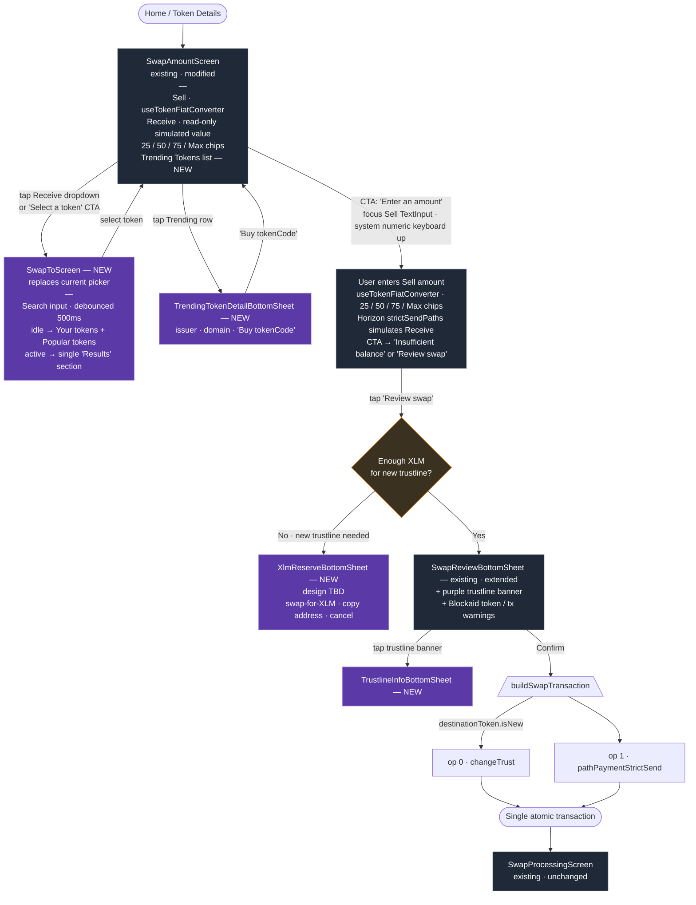

# Swap to New Token — Technical Design

> **Status:** Draft for team review · **Author:** Cassio Goulart · **Date:**
> 2026-05-14
>
> **Companion PRD:** >
> https://docs.google.com/document/d/1NC6Kn0reWqQHS6Mh0Ys3dz87VqCnybF6i_UGO2nY3-c/edit?tab=t.0#heading=h.lucjtj7l2jky
>
> All Figma links on this design doc open specific mocks in the
> [Freighter Mobile design file](https://www.figma.com/design/KwkHXQxbNmDllwermJtnRu/Freighter-Mobile?node-id=11310-100487&m=dev).
> Click any inline link to see the rendered screen.

## 1. Context

Today the Swap flow can only swap between tokens the user already holds (i.e.
tokens with an existing trustline). Adding a new token requires the user to
first complete the "Add a token" flow and only then start a Swap.

**Goal:** allow users to swap from a held token to any Stellar classic asset in
a single flow — discovering tokens through curated/popular lists and free-text
search, and bundling the `changeTrust` op into the swap transaction when needed.

**Out of scope:** swapping to/from Soroban custom tokens. The flow stays
classic-only for now; Soroban support will come later.

## 2. Goals & non-goals

**Goals**

- Single-flow UX from picking a destination token to a confirmed swap.
- Reuse existing search, scan, fiat-toggle, and trustline primitives — avoid
  duplicate components.
- Surface Blockaid token-level signals on every destination token (including
  non-held ones).
- Performance: list rendering remains smooth with 100+ tokens; network calls are
  deduped, cached, and cancellable.
- Scalable to future Soroban-token swaps — the routing layer and Soroban filter
  are isolated behind `useSwapTokenLookup` / `findSwapPath`, so adding Soroban
  path-finding later doesn't require reworking the picker or review UX.

**Non-goals**

- Soroban-token swaps.

## 3. Reference designs

The PRD lists every Figma node; the doc below pulls the most important ones
inline. All links open the same Figma file.

| Screen                       | Figma                                                                                                     | Used for                                  |
| ---------------------------- | --------------------------------------------------------------------------------------------------------- | ----------------------------------------- |
| Swap with Trending Tokens    | [11310-94387](https://www.figma.com/design/KwkHXQxbNmDllwermJtnRu/Freighter-Mobile?node-id=11310-94387)   | New Swap home screen layout               |
| Swap to (picker, default)    | [11310-101382](https://www.figma.com/design/KwkHXQxbNmDllwermJtnRu/Freighter-Mobile?node-id=11310-101382) | Two-section picker: Your tokens + Popular |
| Swap to (search results)     | [11738-38221](https://www.figma.com/design/KwkHXQxbNmDllwermJtnRu/Freighter-Mobile?node-id=11738-38221)   | Single "Results" section                  |
| Trending token detail sheet  | [11694-74469](https://www.figma.com/design/KwkHXQxbNmDllwermJtnRu/Freighter-Mobile?node-id=11694-74469)   | Issuer / domain / "Buy {code}" CTA        |
| Malicious badge on Receive   | [11310-104182](https://www.figma.com/design/KwkHXQxbNmDllwermJtnRu/Freighter-Mobile?node-id=11310-104182) | In-place Blockaid badge on swap inputs    |
| Sell side focused            | [11310-94563](https://www.figma.com/design/KwkHXQxbNmDllwermJtnRu/Freighter-Mobile?node-id=11310-94563)   | Native numeric keyboard state             |
| Token-amount input           | [11738-37895](https://www.figma.com/design/KwkHXQxbNmDllwermJtnRu/Freighter-Mobile?node-id=11738-37895)   | Default mode                              |
| Dollar-amount input          | [11738-38058](https://www.figma.com/design/KwkHXQxbNmDllwermJtnRu/Freighter-Mobile?node-id=11738-38058)   | After tapping RefreshCw03                 |
| Insufficient balance         | [11310-103798](https://www.figma.com/design/KwkHXQxbNmDllwermJtnRu/Freighter-Mobile?node-id=11310-103798) | Disabled CTA state                        |
| Review with trustline banner | [11684-25339](https://www.figma.com/design/KwkHXQxbNmDllwermJtnRu/Freighter-Mobile?node-id=11684-25339)   | "You are swapping" + purple banner        |
| Trustline info sheet         | [11697-19790](https://www.figma.com/design/KwkHXQxbNmDllwermJtnRu/Freighter-Mobile?node-id=11697-19790)   | Tappable explanation                      |
| Review with Blockaid warning | [11310-100817](https://www.figma.com/design/KwkHXQxbNmDllwermJtnRu/Freighter-Mobile?node-id=11310-100817) | Suspicious/malicious destination          |

## 4. High-level architecture



## 5. Data sources & flow

### 5.1 Destination-token discovery (`useSwapTokenLookup`)

Rather than calling `useTokenLookup` directly we introduce a thin wrapper,
`useSwapTokenLookup`, that **composes** the existing primitives and applies
swap-specific filtering. This avoids leaking swap concerns into the general
lookup hook (which is shared with the Add-a-Token flow).

The wrapper exposes two surfaces driven by whether the search term is empty:

**Idle (no search term)** — produces two ordered sections:

1. **Your tokens** — derived from
   [`useBalancesList`](../src/hooks/useBalancesList.ts) (classic only; XLM
   included).
2. **Popular tokens** — intersection of:

   - top 50 stellar.expert assets sorted by `volume7d` (single call — matches
     stellar.expert's default page size, so no over-fetch), and
   - the runtime verified-tokens lists from
     [`ducks/verifiedTokens`](../src/ducks/verifiedTokens.ts) (30-min cached).

   Soroban contracts are filtered out using
   [`helpers/balances.ts:getTokenType`](../src/helpers/balances.ts) /
   [`helpers/soroban.ts:isContractId`](../src/helpers/soroban.ts). The picker's
   "Popular tokens" section additionally hides tokens already in "Your tokens"
   so the user doesn't see them twice on the same screen — but the underlying
   `popularTokens` array kept in the hook includes them. The Trending Tokens
   list on `SwapAmountScreen` consumes the unfiltered array since it has no
   "Your tokens" section above it to visually duplicate, and seeing a held
   token's price + 24h % there can be useful.

**Active (with search term)** — produces one ordered list under a single
"Results" header:

1. Held tokens matching `tokenCode` or `displayName` (partial match,
   balance-value ordered).
2. Verified-list tokens matching the term (excluding tokens already in step 1).
3. Remaining stellar.expert `/asset?search=` results (excluding the above).

If the term is a `G…` account address we fall through to the issuer-lookup path
that [`useTokenLookup`](../src/hooks/useTokenLookup.ts) already supports and
surface the classic assets that address issues. A `C…` contract address is
**not** a structural issuer filter — stellar.expert's `?search=` is a fuzzy
full-text match over asset code, issuer, home domain, **and** TOML metadata.
That means a `C…` query can yield:

- **0 results** — the contract is a custom Soroban token (not a SAC) and no
  Classic record references it; or the index simply has no match.
- **1 result** — most commonly, the `C…` is the deployed SAC (Stellar Asset
  Contract) address of a Classic asset, so stellar.expert returns that single
  Classic record (sample:
  [`/explorer/public/asset?search=CAUIKL3IYG…`](https://api.stellar.expert/explorer/public/asset?search=CAUIKL3IYGMERDRUN6YSCLWVAKIFG5Q4YJHUKM4S4NJZQIA3BAS6OJPK)
  returns AQUA).
- **>1 results** — the `C…` substring incidentally appears in TOML metadata
  (e.g. listed as a related contract or in a free-form description) of one or
  more Classic assets, so stellar.expert returns each of those.

Our handling is uniform across all three: we apply the same classic-only filter
via [`helpers/balances.ts:getTokenType`](../src/helpers/balances.ts) that we use
for any other search term. Classic records that come back pass through; Soroban
contract tokens are filtered out. So a SAC paste typically resolves to its
wrapped classic (and is swappable); a pure Soroban paste yields nothing; an
unusual paste that incidentally matches TOML metadata may show one or more
Classic results, which is acceptable behaviour. We do not special-case the `C…`
shape — the upstream is fuzzy, and our filter keeps the results honest.

**Blockaid scanning** — for both surfaces, every token that isn't already in the
user's balances (which already carries `blockaidData` from the balance
bulk-scan) is run through [`scanBulkTokens`](../src/services/blockaid/api.ts) in
a single batched call. The result is merged onto each record via
[`assessTokenSecurity`](../src/services/blockaid/helper.ts) using the same
`securityLevel`, `isMalicious`, `isSuspicious`, `isUnableToScan` flags the
Add-Token flow uses. This is an important change that **closes a security gap**
since the current swap picker only assesses tokens already in balances.

**Cancellation & dedup** — the wrapper carries forward `useTokenLookup`'s
`AbortController` + `latestRequestRef` pattern so the trailing keystroke wins;
it also dedupes by canonical `CODE:ISSUER` identifier before rendering.

### 5.2 stellar.expert proxy (follow-up)

We are planning on having a `freighter-backend-v2` proxy in front of
stellar.expert so we benefit from our API key + higher rate limits. We'll:

- Create a GH issue in `freighter-backend-v2` for `GET /stellar-expert/asset`
  (passes through `search`, `sort`, `order`, `limit`, `cursor`).
- Keep returning the same `SearchTokenResponse` shape (already updated on this
  `cg-swap-to-new-token` branch), so the frontend easily migrates by swapping
  the service base URL.

Until the proxy lands we can call stellar.expert directly via the existing
[`services/stellarExpert.ts`](../src/services/stellarExpert.ts) — adding one new
method that routes per-network the same way `searchToken` already does (via
`getApiStellarExpertUrl(network)`), so testnet users get testnet trending data
and mainnet users get mainnet:

```ts
fetchTrendingAssets({ network, signal }): Promise<SearchTokenResponse>
//  network=PUBLIC  → GET https://api.stellar.expert/explorer/public/asset?sort=volume7d&order=desc&limit=50
//  network=TESTNET → GET https://api.stellar.expert/explorer/testnet/asset?sort=volume7d&order=desc&limit=50
```

The search-mode call (`/asset?search=…`) reuses the existing `searchToken`
helper unchanged, which already handles both networks.

### 5.3 Pricing for Trending Tokens

Mirrors the Home balances row: prefer [`usePricesStore`](../src/ducks/prices.ts)
`currentPrice` and `percentagePriceChange24h`. When `/token-prices` returns
nothing for a given identifier we **fall back** to stellar.expert's `price`
field from the SearchTokenResponse record; we do not have a 24h % from
stellar.expert so the `%` chip is hidden in the fallback case.

Prices for the Trending list are fetched in one batched call when the swap
screen mounts (or when the Trending list resolves), reusing
`usePricesStore.fetchPricesForTokenIds`.

## 6. State & screens

### 6.1 `useSwapStore` ([`src/ducks/swap.ts`](../src/ducks/swap.ts)) — extensions

Today the store assumes both ends are `PricedBalance` items in
`useBalancesList`. The current signature for `findSwapPath`,
`buildSwapTransaction`, and the review sheet all take
`destinationBalance: PricedBalance` — but that type is over-broad. Auditing the
call sites shows the destination side only reads `id`, `tokenCode`, `issuer`,
and `decimals` (plus `tokenType` for the existing Soroban gate). It never
touches `total`, `currentPrice`, `fiatTotal`, `displayName`, etc.

Rather than fake a `PricedBalance` for non-held destinations, we narrow the
destination slot to a small descriptor that both held and non-held tokens
project into:

```ts
// new — src/components/screens/SwapScreen/helpers/types.ts
export type DestinationTokenDescriptor = {
  id: string; // "CODE:ISSUER" or "XLM"
  tokenCode: string;
  issuer?: string; // omitted for native XLM
  decimals: number; // defaults to 7 for classic; tomlInfo.decimals if present
  tokenType: TokenTypeWithCustomToken;
  isNew: boolean; // false when the user already has a trustline
};
```

Held tokens get a one-line projection from `PricedBalance`; non-held tokens come
straight from a `FormattedSearchTokenRecord` (or the trending-detail sheet's
record). No synthetic balance, no over-typed slots, and the descriptor is a more
accurate type for what the destination side actually consumes.

`SwapState` then becomes:

```ts
interface SwapState {
  // … existing source-side fields unchanged
  sourceTokenId: string;
  sourceTokenSymbol: string;
  // …

  destinationToken: DestinationTokenDescriptor | null; // replaces destinationTokenId + destinationTokenSymbol
  // path-finding fields unchanged
}
```

`setDestinationToken(descriptor: DestinationTokenDescriptor)` replaces the
current `(tokenId, tokenSymbol)` signature. Two thin helpers (live next to the
type) keep call sites tidy and avoid runtime "what shape is this?" branching —
each is a narrow projection of its source plus `isNew` set from the origin
(`false` for balances, `true` for search records that aren't already held):

```ts
descriptorFromBalance(balance: PricedBalance): DestinationTokenDescriptor
descriptorFromSearchRecord(record: FormattedSearchTokenRecord): DestinationTokenDescriptor
```

The call site always knows which source it has — picker rows under "Your tokens"
go through the first, picker rows under "Popular tokens" / "Results" and the
Trending detail sheet go through the second.

The source side stays as `PricedBalance` — it legitimately needs balance + price
for spend validation and the fiat toggle.

`findSwapPath` already drives [`Horizon.strictSendPaths`](../src/ducks/swap.ts),
which accepts a destination asset the user doesn't hold a trustline for — no
Horizon-side change required.

### 6.2 Amount input — adopt `useTokenFiatConverter` + switch to the system numeric keyboard

`SwapAmountScreen` currently has its own numeric input via
`formatNumericInput` + `parseDisplayNumberToBigNumber` + the custom in-app
`NumericKeyboard`. The new Figma replaces that with the **system numeric
keyboard** (see
[11310-94563](https://www.figma.com/design/KwkHXQxbNmDllwermJtnRu/Freighter-Mobile?node-id=11310-94563))
and keeps the token↔fiat toggle from the Send flow.

We adopt the Send flow's shared hook:

- [`src/hooks/useTokenFiatConverter`](../src/hooks/useTokenFiatConverter/index.ts)
  — atomic `useReducer`, locale-aware decimals, conversion math.

…with one small extension. The hook today exposes a per-keystroke entry point
(`handleDisplayAmountChange(key: string)`) designed for the custom keyboard's
`onPress`. The system keyboard reports the full input via
`TextInput.onChangeText(fullText: string)`, so we add a sibling entry point:

```ts
setDisplayAmountFromText(text: string): void
```

It re-uses the existing reducer's parsing and recalculation logic (which already
operates on full strings internally — `recalculateFiatAmountFromToken`,
`recalculateTokenAmountFromFiat`), so the change is additive. The Send flow
keeps calling `handleDisplayAmountChange` and is unaffected.

**On the screen:**

- Sell input: `<TextInput keyboardType="decimal-pad" inputMode="decimal" />`
  driven by `setDisplayAmountFromText`. `decimal-pad` honours the device locale,
  so comma-vs-dot separators Just Work (the reducer already parses both via
  `getNumberFormatSettings()`).
- Token↔fiat toggle: the existing `RefreshCw03` icon next to the Sell value
  flips `showFiatAmount`.
- Receive side: read-only, renders the simulated converted amount + its fiat
  equivalent using the converter's recalculation utilities.

**The Send flow's migration to the system keyboard is already in flight** in
[#856](https://github.com/stellar/freighter-mobile/pull/856) — that PR
introduces the system-keyboard pattern for Send and lands the
`setDisplayAmountFromText` (or equivalent text-based) entry point on
`useTokenFiatConverter`. The Swap work assumes #856 is merged first and re-uses
the new entry point; if Swap lands first, we add the entry point as part of this
work and Send rebases onto it. Either way the per-key
`handleDisplayAmountChange` API stays in place to keep the diff additive.

Why reuse the converter rather than rebuild: it's already proven in production,
removes ~80 LOC of duplication from `SwapAmountScreen`, and ensures swap
inherits any future bug fixes (e.g. locale separators, decimals trimming).

### 6.3 New screens / components

**`SwapToScreen`**
([`src/components/screens/SwapScreen/screens/SwapToScreen.tsx`](../src/components/screens/SwapScreen/screens/SwapToScreen.tsx)
— NEW)

Replaces the current `SwapScreen.tsx` (which today only re-uses
`TokenSelectionContent` over `BalancesList`). Renders:

- `<Input>` search bar (reuses the `Input` SDS component already used in
  Add-Token).
- `<SectionList>` (React Native — virtualised; section equivalent of the
  `FlatList` used by [`BalancesList`](../src/components/BalancesList.tsx)) with
  the section ordering from §5.1.
- Sections are computed memoised arrays from `useSwapTokenLookup`.

We **do not** add FlashList — `SectionList` is sufficient for ~150 rows and
avoids introducing a new dependency.

**`SwapTokenRow`**
([`src/components/screens/SwapScreen/components/SwapTokenRow.tsx`](../src/components/screens/SwapScreen/components/SwapTokenRow.tsx)
— NEW)

Single row used by both the Swap-To picker and the Trending Tokens list.
Composes existing primitives:

- [`<TokenIcon>`](../src/components/TokenIcon.tsx) — already handles
  fallbacks/initials.
- A new `<TokenIconWithBadge>` thin wrapper that overlays the Blockaid
  `AlertCircle` icon (red/amber) — generalises the inline overlay seen at
  [`AddTokenScreen/TokenItem.tsx:43-51`](../src/components/screens/AddTokenScreen/TokenItem.tsx#L43-L51).
  The wrapper lives at `src/components/TokenIconWithBadge.tsx` so the
  Sell/Receive controls can use it.
- Right-hand slot, depending on context:
  - **Held tokens** (`Your tokens` section, plus held tokens that match the
    search): fiat value of the balance (`fiatTotal`) + 24h % change, same layout
    as `BalanceRow` on the Home screen (the token-units amount stays in the
    row's subtitle).
  - **Non-held tokens** (`Popular tokens` section, plus non-held matches in
    search `Results`): a `DotsHorizontal` ellipsis that opens the existing
    [`TokenContextMenu`](../src/components/screens/SwapScreen/components/TokenContextMenu.tsx)
    with "Copy token address" (copies the issuer `G…` for classic assets, the
    `C…` for contracts) and "View on stellar.expert" (opens the asset page via
    [`useInAppBrowser`](../src/hooks/useInAppBrowser.ts), same pattern as
    `BalancesList` and `TransactionDetailsBottomSheet`).
  - **Trending Tokens list** on the Swap home screen: price + 24h % (no ellipsis
    — tapping the row opens `TrendingTokenDetailBottomSheet` instead).

`TokenContextMenu` exists today but its prop is typed as `PricedBalance`. We
widen it to accept a thin reference shape
(`{ id, tokenCode, issuer?, contractId?, tokenType }`) that both held balances
and `FormattedSearchTokenRecord`s satisfy, then call the existing
`getContractAddress` / `getStellarExpertUrl` helpers unchanged. The Add-Token
flow's call sites are unaffected because the widened prop is still satisfied by
`PricedBalance`.

Memoised on the fields the right-slot variant actually reads —
`(tokenCode, issuer, securityLevel)` plus
`(fiatTotal, percentagePriceChange24h)` for held rows or
`(currentPrice, percentagePriceChange24h)` for Trending rows.

**Trending Tokens on `SwapAmountScreen`** (no dedicated component — rendered as
the FlatList body, see §8)

`SwapAmountScreen` itself becomes a single `FlatList` whose
`ListHeaderComponent` is the Sell/Receive/chips block and whose `data` is the
**unfiltered** `popularTokens` array from `useSwapTokenLookup` (the same source
the picker uses, but without the picker's held-token exclusion). Trending
therefore shows both held and non-held tokens — useful for seeing live price +
24h % on tokens the user already holds. `renderItem` returns a `SwapTokenRow`
with the price/% right-hand variant; tapping a row opens:

**`TrendingTokenDetailBottomSheet`**
([`src/components/screens/SwapScreen/components/TrendingTokenDetailBottomSheet.tsx`](../src/components/screens/SwapScreen/components/TrendingTokenDetailBottomSheet.tsx)
— NEW)

Reads `tomlInfo.name`, `tomlInfo.issuer`, `domain`, `price`,
`percentagePriceChange24h` from the record. CTA "Buy {code}" → looks up the
token in `balanceItems`: if found, uses `descriptorFromBalance`
(`isNew: false`); otherwise uses `descriptorFromSearchRecord` (`isNew: true`).
Calls `setDestinationToken(descriptor)` with the result and dismisses.

**`TrustlineInfoBottomSheet`**
([`src/components/screens/SwapScreen/components/TrustlineInfoBottomSheet.tsx`](../src/components/screens/SwapScreen/components/TrustlineInfoBottomSheet.tsx)
— NEW)

Static informational sheet (title, body, "Got it"). Triggered from the purple
banner.

**`XlmReserveBottomSheet`**
([`src/components/screens/SwapScreen/components/XlmReserveBottomSheet.tsx`](../src/components/screens/SwapScreen/components/XlmReserveBottomSheet.tsx)
— NEW)

Renders when the pre-flight reserve check fails (see §6.5). Designs TBD; we can
ship with a functional layout and refit when Figma is ready. It should contain:
a short explainer that the 0.5 XLM trustline reserve is a one-time lock (not a
per-swap fee), plus three buttons —

- **"Swap XLM"** — sets XLM as the _Receive_ token and dismisses, so the user
  can swap any held token for XLM and try again.
- **"Copy wallet address for XLM deposit"** — copies the active account's `G…`
  so the user can fund it from another wallet or exchange.
- **"Cancel"** — dismisses without changes.

### 6.4 `SwapReviewBottomSheet` extensions

Existing component at
[`src/components/screens/SwapScreen/components/SwapReviewBottomSheet.tsx`](../src/components/screens/SwapScreen/components/SwapReviewBottomSheet.tsx).
We add two pieces:

- A purple inline `<Banner>` rendered when `destinationToken.isNew === true`,
  with text "This will add a trustline to {tokenCode}" and a chevron — tap opens
  `TrustlineInfoBottomSheet`.
- The existing Blockaid token/transaction warning logic (`isDestMalicious`,
  `isDestSuspicious`, `isTxMalicious`, …) already works; we just feed it the new
  destination scan result (see §5.1).

No change to `SwapReviewFooter`'s confirm/cancel buttons.

### 6.5 Transaction building — `buildSwapTransaction`

Today
[`useTransactionBuilderStore.buildSwapTransaction`](../src/ducks/transactionBuilder.ts)
builds a single `pathPaymentStrictSend` op. We extend it:

```ts
buildSwapTransaction({
  …existing,
  includeTrustline?: { tokenCode: string; issuer: string }, // NEW
}): Promise<string /* XDR */>
```

When present, the builder prepends a `changeTrust` operation (asset =
`new Asset(tokenCode, issuer)`, no limit ⇒ max) so both ops are submitted
atomically in a single transaction. We extract the op-creation portion of
[`buildChangeTrustTx`](../src/services/stellar.ts) into a small sibling helper
`buildChangeTrustOperation(tokenCode, issuer)` in the same file
(`src/services/stellar.ts`) so both call sites (Add-Token, Swap) share it.
`buildChangeTrustTx` is refactored to call the helper internally — no behaviour
change for the Add-Token flow.

`useSwapTransaction.setupSwapTransaction` passes
`includeTrustline: destinationToken.isNew ? { tokenCode: destinationToken.tokenCode, issuer: destinationToken.issuer! } : undefined`.
The non-null assertion on `issuer` is safe: a destination with `isNew: true` is
by definition a non-native classic asset (you can't add a trustline to native
XLM), so the issuer is always present — but we can replace the `!` with an
explicit guard + `logger.error` in the unreachable branch for belt-and-braces.
Blockaid's transaction scan now sees the combined XDR, which gives us
defence-in-depth on top of the per-token scan.

**Pre-flight XLM reserve check** — before triggering `buildSwapTransaction`, we
compute the new base reserve cost (0.5 XLM per new trustline) and compare to the
user's spendable XLM (already exposed via `BalancesList` /
`getSpendableBalance`). If insufficient → open `XlmReserveBottomSheet` and
abort. We deliberately do this client-side rather than relying on Horizon's
`tx_insufficient_balance` for a better UX.

### 6.6 CTA state machine on `SwapAmountScreen`

| State        | Condition                   | Label                             | Action on tap                                                                                                                                                                               |
| ------------ | --------------------------- | --------------------------------- | ------------------------------------------------------------------------------------------------------------------------------------------------------------------------------------------- |
| Select       | no destination selected     | "Select a token"                  | navigate → `SwapToScreen`                                                                                                                                                                   |
| Enter        | destination set, amount = 0 | "Enter an amount"                 | focus Sell `TextInput` (system numeric keyboard slides up)                                                                                                                                  |
| Insufficient | amount > spendable          | "Insufficient balance" (disabled) | —                                                                                                                                                                                           |
| Loading      | path-finding in flight      | spinner                           | —                                                                                                                                                                                           |
| Review       | amount valid & path found   | "Review swap"                     | run the pre-flight XLM-reserve check (§6.5) — if a trustline is needed and spendable XLM is below the 0.5 XLM reserve, open `XlmReserveBottomSheet`; otherwise open `SwapReviewBottomSheet` |

Implemented as a derived `useMemo` returning a discriminated union; renders the
SDS `<Button>` accordingly. The reserve-check branch only triggers when
`destinationToken.isNew === true` — held-to-held swaps go straight to the review
sheet.

## 7. Component reuse summary

| Concern                     | Reuse                                                                                                                                                                                       | New                                                                          |
| --------------------------- | ------------------------------------------------------------------------------------------------------------------------------------------------------------------------------------------- | ---------------------------------------------------------------------------- |
| Token search hook           | [`useTokenLookup`](../src/hooks/useTokenLookup.ts) (core)                                                                                                                                   | `useSwapTokenLookup` (wrapper)                                               |
| Token↔fiat amount input    | [`useTokenFiatConverter`](../src/hooks/useTokenFiatConverter/index.ts) (extended with `setDisplayAmountFromText`), RN `TextInput` with `keyboardType="decimal-pad"`, `KeyboardAvoidingView` | —                                                                            |
| Token icon + security badge | [`TokenIcon`](../src/components/TokenIcon.tsx), badge pattern from [`AddTokenScreen/TokenItem`](../src/components/screens/AddTokenScreen/TokenItem.tsx)                                     | `TokenIconWithBadge` (shared wrapper)                                        |
| Picker layout               | SDS `<Input>`, `SectionList`                                                                                                                                                                | `SwapToScreen`, `SwapTokenRow`                                               |
| Row context menu            | [`TokenContextMenu`](../src/components/screens/SwapScreen/components/TokenContextMenu.tsx) (widened prop), [`useInAppBrowser`](../src/hooks/useInAppBrowser.ts), `getStellarExpertUrl`      | —                                                                            |
| Trending list & detail      | `usePricesStore`, `SwapTokenRow`, `FlatList` (as `SwapAmountScreen` body)                                                                                                                   | `TrendingTokenDetailBottomSheet`                                             |
| Transaction builder         | `pathPaymentStrictSend` path                                                                                                                                                                | `buildChangeTrustOperation` helper (extracted), `includeTrustline` flag      |
| Review sheet                | [`SwapReviewBottomSheet`](../src/components/screens/SwapScreen/components/SwapReviewBottomSheet.tsx)                                                                                        | inline trustline banner, `TrustlineInfoBottomSheet`, `XlmReserveBottomSheet` |
| Blockaid scanning           | [`scanBulkTokens`](../src/services/blockaid/api.ts), [`assessTokenSecurity`](../src/services/blockaid/helper.ts), `useBlockaidTransaction`                                                  | — (data flow change only)                                                    |
| Verified token lists        | [`ducks/verifiedTokens`](../src/ducks/verifiedTokens.ts), `splitVerifiedTokens`                                                                                                             | —                                                                            |

Nothing on this list duplicates an existing component. The six new components
introduced above (`SwapToScreen`, `SwapTokenRow`,
`TrendingTokenDetailBottomSheet`, `TrustlineInfoBottomSheet`,
`XlmReserveBottomSheet`, and the shared `TokenIconWithBadge` wrapper) are all
single-purpose with clear inputs / outputs (a token record + callbacks). The new
`useSwapTokenLookup` hook composes existing primitives instead of
re-implementing them; the trustline-reserve pre-flight check lives inline in
`SwapAmountScreen` as a small helper (no new hook needed for a single use site).

## 8. Performance considerations

- **Network calls**: 1 stellar.expert trending call on mount, 1 verified-lists
  call (already 30-min cached), 1 Blockaid bulk scan for non-held tokens. Search
  adds 1 stellar.expert `/asset?search=` per debounced keystroke (500 ms via the
  existing [`useDebounce`](../src/hooks/useDebounce.ts) +
  `DEFAULT_DEBOUNCE_DELAY`), reusing `AbortController`-based cancellation so
  only the latest request lands.
- **List virtualization**: `SectionList` for the picker (multiple sections). On
  `SwapAmountScreen` the Trending list shows the full popular-tokens set (up to
  50 rows, capped by the stellar.expert fetch), so we structure the screen as a
  **single `FlatList`** whose `ListHeaderComponent` contains the Sell input,
  swap-direction chevron, Receive display, and 25/50/75/Max chips, with the
  Trending rows as the virtualized body. The top nav bar stays sticky at the top
  (default); the CTA button sits in a sticky footer outside the `FlatList`,
  wrapped in `KeyboardAvoidingView` so it lifts above the system numeric
  keyboard when the Sell input is focused. This is the same `FlatList` primitive
  already used by [`BalancesList`](../src/components/BalancesList.tsx) on the
  Home screen — no nested scroll views, virtualization stays intact, and the
  Sell/Receive blocks scroll off naturally as the user browses Trending.
- **Icon caching**: routed through
  [`ducks/tokenIcons`](../src/ducks/tokenIcons.ts) — already handles lazy fetch,
  5 s background refresh, persisted cache.
- **Price batching**: single `fetchPricesForTokenIds` call with the union of
  Trending + held tokens; dedupe already lives inside the store.
- **Memoisation**: `SwapTokenRow` is memoised on the fields above; section
  arrays are memoised in `useSwapTokenLookup` to keep `SectionList` re-renders
  cheap.
- **Bundle size**: no new dependencies. Reusing `SectionList` and existing SDS
  components.
- **Failure modes**: `useSwapTokenLookup` inherits the existing `useTokenLookup`
  pattern — stellar.expert / Blockaid errors are caught and surfaced via
  `status: HookStatus.ERROR`, with held tokens still rendered from
  `useBalancesList` so the picker never goes blank. Search continues to work
  without Blockaid signals on testnet (where bulk-scan is unsupported), with
  `securityLevel = UNABLE_TO_SCAN` driving the same warning treatment as the
  Add-Token flow.
- **Empty states**: idle picker with no held tokens (new account) renders only
  the "Popular tokens" section. Search-with-no-results renders an empty
  "Results" header with a short "No tokens match {term}" line, reusing the same
  empty-state pattern from `AddTokenScreen`. Trending list on testnet, where
  stellar.expert returns mainnet-only data, is hidden behind a network check so
  we don't render a confusing empty list.

## 9. Security

- Every destination-token candidate (held, popular, search result) is run
  through Blockaid before becoming selectable. The picker, the Trending list,
  the Sell/Receive icon, and the review sheet all read from the same
  `assessTokenSecurity` output keyed by `CODE-ISSUER`.
- The transaction scan in `setupSwapTransaction` sees the combined
  `changeTrust + pathPaymentStrictSend` XDR.
- "In place" badge on Sell/Receive icons via `TokenIconWithBadge` ensures the
  warning is visible even with the picker closed (per Figma
  [11310-104182](https://www.figma.com/design/KwkHXQxbNmDllwermJtnRu/Freighter-Mobile?node-id=11310-104182)).
- Mainnet-only Blockaid restriction is unchanged — on testnet the badges are
  absent and the warning state is "unable to scan", same as today.

## 10. Telemetry

Lightweight additions to the
[`AnalyticsEvent`](../src/config/analyticsConfig.ts) enum and a small set of
trackers under [`services/analytics`](../src/services/analytics/). Naming
follows the existing convention: `UPPERCASE_SNAKE_CASE` for the enum member, a
colon-prefixed lowercase string for the Amplitude payload (e.g.
`SWAP_SUCCESS = "swap: success"`).

- `SWAP_TO_PICKER_OPENED = "swap: to-picker opened"` —
  `{ source: "cta" | "dropdown" }`
- `SWAP_TRENDING_TOKEN_TAPPED = "swap: trending token tapped"` —
  `{ tokenCode, position }`
- `SWAP_TRENDING_BUY_PRESSED = "swap: trending buy pressed"` — `{ tokenCode }`
- `SWAP_DESTINATION_SELECTED = "swap: destination selected"` —
  `{ tokenCode, isNew, source: "trending" | "popular" | "search" | "balances" }`
- `SWAP_TRUSTLINE_ADDED = "swap: trustline added"` — `{ tokenCode }`, fired once
  the combined tx confirms.
- `SWAP_XLM_RESERVE_INSUFFICIENT_SHOWN = "swap: xlm reserve insufficient shown"`

These let us measure the discovery → swap funnel and the impact on first-time
trustline creation.

## 11. Backend follow-up

GH issue (to be filed against `freighter-backend-v2`):

> **Title:** Add `/stellar-expert/asset` proxy for higher-rate-limit access
>
> **Body:** Proxy `GET https://api.stellar.expert/explorer/public|testnet/asset`
> and `GET .../asset/:id`, forwarding `search`, `sort`, `order`, `limit`,
> `cursor`. Return the same JSON shape (`SearchTokenResponse` as updated on
> `cg-swap-to-new-token`). Auth using our existing stellar.expert API key.
> Mobile will swap base URL once available.

Until that lands, mobile calls stellar.expert directly with no API key (the
existing `services/stellarExpert.ts` pattern).

## 12. Verification plan

- **Unit**

  - `useSwapTokenLookup` ordering & dedupe: held first, verified-popular by
    `volume7d` desc, stellar.expert remainder; Soroban filtered; search-mode
    flattens to a single "Results" array.
  - `buildSwapTransaction` with `includeTrustline` produces a tx with
    `changeTrust` as op #0 and `pathPaymentStrictSend` as op #1; without it
    produces a single op (regression).
  - CTA selector transitions (the derived `useMemo` from §6.6) for all five
    states.

- **Integration / manual** (mainnet, on a device or simulator)

  1. Open Swap from Home → CTA reads "Select a token". Tap → `SwapToScreen`
     opens, idle view shows held + popular sections.
  2. Pick a held token → CTA flips to "Enter an amount" → Sell input focuses,
     keyboard rises.
  3. Type an amount → Receive side simulates value + fiat. Toggle RefreshCw03 →
     Sell flips to fiat mode.
  4. Pick the same token on the opposite side → opposite side clears (selection
     swap rule).
  5. Pick a **non-held** token, enter a valid amount, tap "Review swap" → Review
     sheet opens with the purple trustline banner. Tap banner → info sheet.
  6. Repeat step 5 on a low-XLM test account (below the 0.5 XLM trustline
     reserve) → `XlmReserveBottomSheet` appears instead of the Review sheet; tap
     "Swap XLM" → flips Receive to XLM.
  7. With a funded account, confirm the Review sheet → tx confirms; Stellar
     Expert shows `changeTrust + pathPaymentStrictSend` in one envelope.
  8. Search "usd" → single Results section with held > verified > stellar.expert
     ordering; pick an unverified result → badge in place on Receive + warning
     banner in review.
  9. Paste a `G…` account address → Results lists the classic assets that
     account issues. Paste a SAC `C…` (e.g. AQUA's SAC, see §5.1 sample link) →
     Results contains the wrapped Classic asset. Paste a pure-Soroban `C…` →
     Results is empty (Soroban token filtered out). Acceptable that an unusual
     `C…` could match incidental TOML metadata and yield >1 Classic results —
     confirm the classic-only filter still applies in that case.
  10. Soroban assets never appear in either picker section, including during
      search.
  11. Switch network to **testnet** and repeat steps 1–8 with testnet token
      issuers (e.g. SRT). Trending list hits `/explorer/testnet/asset`; search
      hits `/explorer/testnet/asset?search=…`; Blockaid badges are absent
      (mainnet-only) and the warning state is "unable to scan", as today.

- **Regression**
  - Existing held-to-held swap (no trustline addition) still works end-to-end
    and produces a single-op tx.
  - Add-a-Token flow is unaffected — it still calls `buildChangeTrustTx`
    (refactored internally to delegate to `buildChangeTrustOperation`, no
    behaviour change) and continues to share `useTokenLookup`.
  - Send flow's amount input is unaffected by Swap changes (Send is being
    migrated separately in
    [#856](https://github.com/stellar/freighter-mobile/pull/856); both consumers
    share the same `useTokenFiatConverter`).

## 13. Rollout

- Single PR stack (or feature branch `cg-swap-to-new-token` → main).
- No feature flag — the new picker fully replaces the current swap picker; the
  change is incremental enough that flagging adds more risk than it removes.
- The `SwapAmountScreen` adoption of `useTokenFiatConverter` lands inside this
  Swap PR (not split out), so the screen ships consistent. The
  `setDisplayAmountFromText` converter extension itself comes from whichever PR
  lands first — this one or
  [#856](https://github.com/stellar/freighter-mobile/pull/856) — per §6.2.
- Coordinate the backend proxy GH issue as a separate stream; the frontend flow
  can be initially merged using stellar.expert directly.

## 14. Open questions

1. **Trending price fallback** — when `/token-prices` lacks a token, do we show
   stellar.expert's `price` with no 24h %, or hide the price entirely? Current
   proposal: show price, hide %.
2. **`XlmReserveBottomSheet` design** — designs TBD. We can start with a
   functional layout and update when Figma is ready.
3. **Backend proxy timing** — fine to ship the frontend flow first and migrate
   once the proxy is live?
