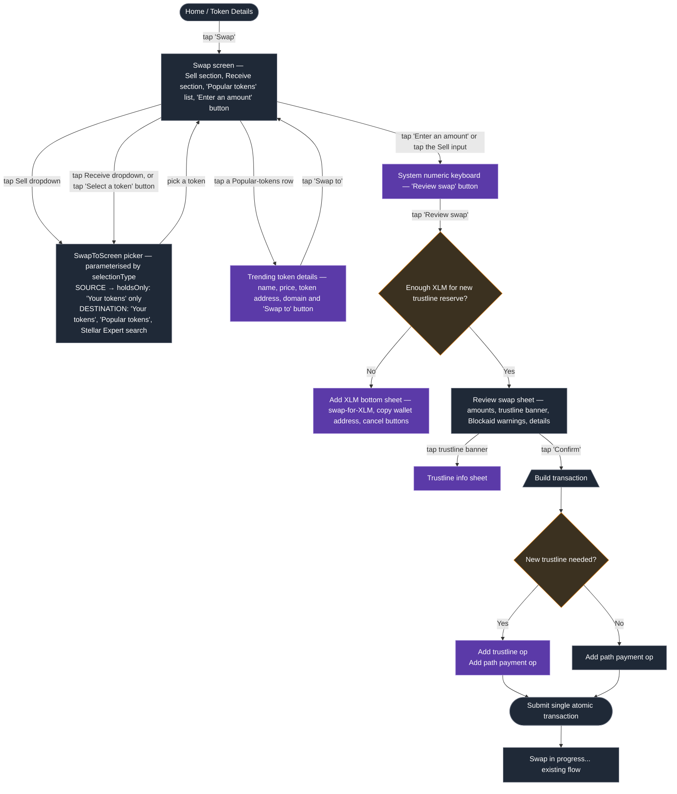

# Swap to New Token — Technical Design

> **Status:** Draft for team review · **Author:** Cassio Goulart · **Date:**
> 2026-05-14
>
> **Companion PRD:** >
> https://docs.google.com/document/d/1NC6Kn0reWqQHS6Mh0Ys3dz87VqCnybF6i_UGO2nY3-c/edit?tab=t.0#heading=h.lucjtj7l2jky
>
> All Figma links on this design doc open specific mocks in the
> [Freighter Mobile design file](https://www.figma.com/design/KwkHXQxbNmDllwermJtnRu/Freighter-Mobile?node-id=11310-100487&m=dev).
> Click any inline link to see the rendered screen.
>
> **Implementation note (2026-06-22):** this doc has been re-synced with the
> `cg-swap-to-new-token` branch as it stands at PR approval, immediately before
> merge. Sections below describe the code as built; where the original design
> intent and the implementation diverged, the text reflects the code. This pass
> reconciled the fee model (total-across-ops fee split), the reserve pre-flight
> non-XLM branch, the unable-to-scan CTA gate (now a post-scan decision that
> includes the transaction-level scan), the review banner, and the quote-expiry
> recovery path.

## 1. Context

Today the Swap flow can only swap between tokens the user already holds (i.e.
tokens with an existing trustline). Adding a new token requires the user to
first complete the "Add a token" flow and only then start a Swap.

**Goal:** allow users to swap from a held token to any Stellar classic asset in
a single flow — discovering tokens through curated/popular lists and free-text
search, and bundling the `changeTrust` op into the swap transaction when needed.

**Out of scope:** swapping to/from Soroban custom tokens. The flow stays
classic-only for now; Soroban support will come later.

## 2. Goals & non-goals

**Goals**

- Single-flow UX from picking a destination token to a confirmed swap.
- Reuse existing search, scan, fiat-toggle, and trustline primitives — avoid
  duplicate components.
- Surface Blockaid token-level signals on every destination token (including
  non-held ones).
- Performance: list rendering remains smooth with 100+ tokens; network calls are
  deduped, cached, and cancellable.
- Scalable to future Soroban-token swaps — the routing layer and Soroban filter
  are isolated behind `useSwapTokenLookup` / `findSwapPath`, so adding Soroban
  path-finding later doesn't require reworking the picker or review UX.

**Non-goals**

- Soroban-token swaps.

## 3. Reference designs

The PRD lists every Figma node; the doc below pulls the most important ones
inline. All links open the same Figma file.

| Screen                       | Figma                                                                                                     | Used for                                                       |
| ---------------------------- | --------------------------------------------------------------------------------------------------------- | -------------------------------------------------------------- |
| Swap with Trending Tokens    | [11310-94387](https://www.figma.com/design/KwkHXQxbNmDllwermJtnRu/Freighter-Mobile?node-id=11310-94387)   | New Swap home screen layout                                    |
| Swap to (picker, default)    | [11310-101382](https://www.figma.com/design/KwkHXQxbNmDllwermJtnRu/Freighter-Mobile?node-id=11310-101382) | Two-section picker: Your tokens + Popular                      |
| Swap to (search results)     | [11738-38221](https://www.figma.com/design/KwkHXQxbNmDllwermJtnRu/Freighter-Mobile?node-id=11738-38221)   | Single "Results" section                                       |
| Trending token detail sheet  | [11694-74469](https://www.figma.com/design/KwkHXQxbNmDllwermJtnRu/Freighter-Mobile?node-id=11694-74469)   | Token Address (Issuer for XLM) / domain / "Swap to {code}" CTA |
| Malicious badge on Receive   | [11310-104182](https://www.figma.com/design/KwkHXQxbNmDllwermJtnRu/Freighter-Mobile?node-id=11310-104182) | In-place Blockaid badge on swap inputs                         |
| Sell side focused            | [11310-94563](https://www.figma.com/design/KwkHXQxbNmDllwermJtnRu/Freighter-Mobile?node-id=11310-94563)   | Native numeric keyboard state                                  |
| Token-amount input           | [11738-37895](https://www.figma.com/design/KwkHXQxbNmDllwermJtnRu/Freighter-Mobile?node-id=11738-37895)   | Default mode                                                   |
| Dollar-amount input          | [11738-38058](https://www.figma.com/design/KwkHXQxbNmDllwermJtnRu/Freighter-Mobile?node-id=11738-38058)   | After tapping the token↔fiat toggle (`RefreshCcw03`)          |
| Insufficient balance         | [11310-103798](https://www.figma.com/design/KwkHXQxbNmDllwermJtnRu/Freighter-Mobile?node-id=11310-103798) | Disabled CTA state                                             |
| Review with trustline banner | [11684-25339](https://www.figma.com/design/KwkHXQxbNmDllwermJtnRu/Freighter-Mobile?node-id=11684-25339)   | "You are swapping" + purple banner                             |
| Trustline info sheet         | [11697-19790](https://www.figma.com/design/KwkHXQxbNmDllwermJtnRu/Freighter-Mobile?node-id=11697-19790)   | Tappable explanation                                           |
| Review with Blockaid warning | [11310-100817](https://www.figma.com/design/KwkHXQxbNmDllwermJtnRu/Freighter-Mobile?node-id=11310-100817) | Suspicious/malicious destination                               |
| Add XLM bottom sheet         | [11821-35601](https://www.figma.com/design/KwkHXQxbNmDllwermJtnRu/Freighter-Mobile?node-id=11821-35601)   | Insufficient XLM for trustline reserve                         |

## 4. High-level architecture



**Legend:** Purple = new screen / sheet / step. Slate = exists today (kept or
extended for this work). What each screen does, what it renders, and how state
flows through it is in §6 — this diagram is the navigation graph only.

**One picker, parameterised.** There is a single picker screen, not separate
Sell/Receive pickers. Both dropdowns push the same `SWAP_SCREEN` route
(`SwapToScreen`); the only difference is the `selectionType` param, which
toggles `holdsOnly` (Sell side → held tokens only) and the header title ("Swap
from" / "Swap to").

**Route table** (`SWAP_ROUTES`,
[`src/config/routes.ts`](../src/config/routes.ts); stack wired in
[`src/navigators/SwapNavigator.tsx`](../src/navigators/SwapNavigator.tsx)):

| Route constant       | Route name           | Component                                        | Params                                         |
| -------------------- | -------------------- | ------------------------------------------------ | ---------------------------------------------- |
| `SWAP_AMOUNT_SCREEN` | `"SwapAmountScreen"` | `SwapAmountScreen` (stack **initial route**)     | `{ tokenId: string; tokenSymbol: string }`     |
| `SWAP_SCREEN`        | `"SwapScreen"`       | `SwapToScreen` (token picker, **pushed** on top) | `{ selectionType: "source" \| "destination" }` |

The amount screen is the stack root and the picker is pushed on top, so its
`slide_from_bottom` open animation has a true inverse on dismiss (`goBack` =
slide-down). Note the mapping is slightly confusing: the constant named
`SWAP_SCREEN` ("SwapScreen") is the _picker_ component `SwapToScreen`, not the
amount screen.

**Naming:** the user-facing section header is **"Popular tokens"**
(`swapScreen.popularTokensSection`) on _both_ the `SwapAmountScreen` in-screen
list and the `SwapToScreen` picker — there is no on-screen "Trending Tokens"
label. Throughout this doc, "Trending Tokens" / "Trending list" refers only to
the `SwapAmountScreen` list's internal identity (`trendingTokens`,
`variant="trending"`, `useTrendingTokenDetail`, the `SWAP_TRENDING_*` analytics
events, the `swap-amount-trending-list` testID), which intentionally keep the
`trending` name. The only swap-facing strings under the trending namespace are
`swapScreen.trendingDetail.*` for the detail bottom sheet.

## 5. Data sources & flow

### 5.1 Destination-token discovery (`useSwapTokenLookup`)

Rather than calling `useTokenLookup` directly we introduce a dedicated hook,
`useSwapTokenLookup`, that **mirrors `useTokenLookup`'s patterns** (debounce,
abort, cancellation) but applies swap-specific filtering, two-section output,
and Blockaid bulk-scanning. It's a parallel implementation rather than a wrapper
— the swap-specific logic (Soroban filtering, trending intersection,
`hadSorobanMatches` state, multi-section output, `holdsOnly` mode) made
composition awkward, and `useTokenLookup`'s shape didn't accommodate the
held-vs-non-held bifurcation cleanly. This avoids leaking swap concerns into the
general lookup hook (which is shared with the Add-a-Token flow).

The hook exposes two surfaces driven by whether the search term is empty:

**Idle (no search term)** — produces two ordered sections:

1. **Your tokens** — derived from
   [`useBalancesList`](../src/hooks/useBalancesList.ts) (classic only; XLM
   included).
2. **Popular tokens** — intersection of:

   - top 50 stellar.expert assets sorted by `volume7d` (single call — matches
     stellar.expert's default page size, so no over-fetch), and
   - the runtime verified-tokens lists from
     [`ducks/verifiedTokens`](../src/ducks/verifiedTokens.ts) (30-min cached).

   Soroban contracts are filtered out using
   [`helpers/balances.ts:getTokenType`](../src/helpers/balances.ts) /
   [`helpers/soroban.ts:isContractId`](../src/helpers/soroban.ts). On mainnet,
   records below a minimum 7-day volume floor (`MIN_TRENDING_VOLUME7D` =
   `70_000_000_000`, i.e. ≈ $7,000 USD in stellar.expert's 10^7-scaled
   representation) are dropped inside the `cachedFetch` closure in
   [`ducks/stellarExpertTopTokens.ts`](../src/ducks/stellarExpertTopTokens.ts)
   _before_ the response is cached, so low-volume tokens never reach the
   intersection. The floor is a no-op on testnet (where `volume7d` is always 0,
   so applying it would empty the list).

   The hook keeps two related arrays. `popularTokens` is the trending
   intersection with held tokens filtered out
   (`trendingTokens.filter(t => !hasExistingTrustline(...))`) — the picker's
   "Popular tokens" section reads this, so the user never sees a held token
   twice on the same screen. `trendingTokens` is the held-**inclusive** array,
   and it's what the `SwapAmountScreen` in-screen list consumes — that screen
   has no "Your tokens" section above it to visually duplicate, and seeing a
   held token's price + 24h % there is useful.

**Active (with search term)** — produces three labeled, mutually exclusive
ordered sections:

1. **Your tokens** — held tokens matching `tokenCode` or `displayName` (partial
   match, balance-value ordered).
2. **Verified** — verified-list tokens matching the term (excluding tokens
   already in step 1). Section header includes a tappable `(i)` info icon
   explaining what the verified-token lists are.
3. **Unverified** — remaining stellar.expert `/asset?search=` results (excluding
   the above). Section header includes its own tappable `(i)` info icon for the
   "unverified" caveat.

If the term is a `G…` issuer address, it's passed verbatim to stellar.expert's
fuzzy `?search=`. The index covers issuer fields, so this typically returns the
classic assets that account issues — the same observed behaviour as a structural
issuer filter, achieved through fuzzy text matching. `useTokenLookup` behaves
the same way for `G…`; only the `C…` branch is special-cased there (via the
freighter-backend `handleContractLookup`), and `useSwapTokenLookup` doesn't
carry that branch since contract IDs aren't viable swap destinations anyway.

A `C…` contract address is **not** a structural issuer filter — stellar.expert's
`?search=` is a fuzzy full-text match over asset code, issuer, home domain,
**and** TOML metadata. That means a `C…` query can yield:

- **0 results** — the contract is a custom Soroban token (not a SAC) and no
  Classic record references it; or the index simply has no match.
- **1 result** — most commonly, the `C…` is the deployed SAC (Stellar Asset
  Contract) address of a Classic asset, so stellar.expert returns that single
  Classic record (sample:
  [`/explorer/public/asset?search=CAUIKL3IYG…`](https://api.stellar.expert/explorer/public/asset?search=CAUIKL3IYGMERDRUN6YSCLWVAKIFG5Q4YJHUKM4S4NJZQIA3BAS6OJPK)
  returns AQUA).
- **>1 results** — the `C…` substring incidentally appears in TOML metadata
  (e.g. listed as a related contract or in a free-form description) of one or
  more Classic assets, so stellar.expert returns each of those.

Our handling is uniform across all three: we apply the same classic-only filter
via [`helpers/balances.ts:getTokenType`](../src/helpers/balances.ts) that we use
for any other search term. Classic records that come back pass through; Soroban
contract tokens are filtered out. So a SAC paste typically resolves to its
wrapped classic (and is swappable); a pure Soroban paste yields nothing; an
unusual paste that incidentally matches TOML metadata may show one or more
Classic results, which is acceptable behaviour. We do not special-case the `C…`
shape upstream — the search is fuzzy, and our filter keeps the results honest.

**Empty-state copy when the user was searching for a Soroban token.** The picker
swaps the generic "No tokens match {term}" line for **"Soroban contract tokens
aren't supported for swaps yet. Try searching for a Classic token instead."**
whenever the filtered result list is empty **and** either of the following
holds:

- **The search term is a contract address** (`isContractId(term)`). Covers pure
  Soroban pastes (the intended case) and the rare "unrelated `C…` that matched
  nothing" case — both land on the same message, which is still defensible: we
  don't support either as a swap destination today. No extra network call to
  verify the contract is actually a SEP-41 token.
- **The pre-filter result set contained one or more Soroban contract tokens that
  matched the term**, tracked via a `hadSorobanMatches` flag on the
  `useSwapTokenLookup` state. Covers the name/symbol case: e.g. searching for a
  Soroban-only project by name returns Soroban records from stellar.expert that
  the classic-only filter drops, leaving an empty Results section that would
  otherwise look like "nothing matched".

When both classic and Soroban records match a term (e.g. a generic query like
"USD"), the classic results render normally and no notice is shown — the user
gets useful results. The Soroban message is reserved for the truly empty Results
state.

**Caching & freshness** — the hook has a three-layer cache stack:

- Module-scoped `trendingMemoryCacheByNetwork` survives remounts so re-entering
  the swap flow paints the trending list synchronously without a spinner.
- Disk-backed 30-min caches for the trending endpoint and verified-tokens JSON
  via the shared `cachedFetch` helper. Blockaid bulk-scan responses use a
  _separate_ per-token disk cache in
  [`ducks/blockaidTokenScans`](../src/ducks/blockaidTokenScans.ts) (its own
  30-min TTL via a per-entry `_cachedAt` / `isFresh` check, not `cachedFetch`).
- SWR pipeline: read disk caches → render preliminary list → revalidate in
  background. Pull-to-refresh (`refreshTrending`) force-revalidates all three
  layers in parallel.

**`holdsOnly` mode** — the same hook drives the "Swap from" picker by setting
`holdsOnly: true`, which short-circuits all stellar.expert / Blockaid pipelines
and returns a pure in-memory filter over balances.

**Blockaid scanning** — for both surfaces, every token that isn't already in the
user's balances (which already carries `blockaidData` from the balance
bulk-scan) is run through [`scanBulkTokens`](../src/services/blockaid/api.ts) in
a single batched call (wrapped by a `scanBulkWithCache` SWR layer in
`ducks/blockaidTokenScans`). The result is merged onto each record via
[`assessTokenSecurity`](../src/services/blockaid/helper.ts) using the same
`securityLevel`, `isMalicious`, `isSuspicious`, `isUnableToScan` flags the
Add-Token flow uses. This is an important change that **closes a security gap**
since the current swap picker only assesses tokens already in balances.

**Cancellation & dedup** — the hook carries forward `useTokenLookup`'s
`AbortController` + `latestRequestRef` pattern so the trailing keystroke wins;
it also dedupes by canonical `CODE:ISSUER` identifier before rendering. The
trending pipeline keeps a separate `trendingAbortRef` so trending revalidation
and search-mode fetches don't cancel each other.

### 5.2 stellar.expert proxy (follow-up)

We are planning on having a `freighter-backend-v2` proxy in front of
stellar.expert so we benefit from our API key + higher rate limits. We'll:

- Create a GH issue in `freighter-backend-v2` for `GET /stellar-expert/asset`
  (passes through `search`, `sort`, `order`, `limit`, `cursor`).
- Keep returning the same `SearchTokenResponse` shape (already updated on this
  `cg-swap-to-new-token` branch), so the frontend easily migrates by swapping
  the service base URL.

Until the proxy lands we call stellar.expert directly via
[`services/stellarExpert.ts`](../src/services/stellarExpert.ts). The new method
(already shipped on this branch) routes per-network the same way `searchToken`
does (via two `createApiService` instances built from
`getApiStellarExpertUrl(NETWORKS.PUBLIC | NETWORKS.TESTNET)`), so testnet users
get testnet trending data and mainnet users get mainnet:

```ts
fetchTrendingAssets({ network, signal }): Promise<SearchTokenResponse | null>
//  network=PUBLIC  → GET https://api.stellar.expert/explorer/public/asset?sort=volume7d&order=desc&limit=50
//  network=TESTNET → GET https://api.stellar.expert/explorer/testnet/asset?limit=50
//                    (volume7d is always 0 on testnet, so we omit the sort
//                     and accept whatever order the API returns —
//                     verified-tokens intersection is what produces a
//                     meaningful list there.)
```

It returns `null` (rather than throwing) on a caught error or a canceled
request; that `null` is what drives the cache-skip and the `stellarExpertDown`
fallback downstream (§5.4). On mainnet the cached payload is additionally
filtered to drop sub-`MIN_TRENDING_VOLUME7D` records before caching (see §5.1),
so the disk cache already excludes low-volume tokens and consumers never
re-filter.

The search-mode call (`/asset?search=…`) reuses the existing `searchToken`
helper unchanged, which already handles both networks.

### 5.3 Pricing for Trending Tokens

Mirrors the Home balances row: prefer [`usePricesStore`](../src/ducks/prices.ts)
`currentPrice` and `percentagePriceChange24h`. When `/token-prices` returns
nothing for a given identifier we **fall back** to stellar.expert's `price`
field from the SearchTokenResponse record; we do not have a 24h % from
stellar.expert in the fallback case. The two surfaces handle the missing 24h %
differently: the **trending detail sheet** omits the `%` delta string entirely
(no `percentagePriceChange24h` → the `<Text>` isn't rendered), while the
**trending list row** always renders the `%` slot and shows a `--` placeholder
in the fallback case rather than removing it.

Prices for the Trending list are fetched in one batched call when the swap
screen mounts (or when the Trending list resolves), reusing
`usePricesStore.fetchPricesForTokenIds` via the `useSwapTokenPrices` hook. The
hook also accepts an `extraTokenIds` argument so the selected destination's
price is always fetched, even when the token isn't on the trending list.

### 5.4 Fallback when stellar.expert is unreachable

Three of the new surfaces depend on stellar.expert: the Trending Tokens list on
`SwapAmountScreen`, the "Popular tokens" section in the picker, and the
cross-network search results in the picker. When the request fails (network
error, 5xx, timeout) we degrade gracefully so the user can still complete a swap
between tokens they hold:

- **Trending Tokens list** — hidden on `SwapAmountScreen`. The screen renders
  Sell / Receive / chips / CTA only; the FlatList body is empty so the layout
  collapses cleanly.
- **"Popular tokens" section in the picker** — omitted. The picker shows only
  the "Your tokens" section.
- **Cross-network search in the picker** — `Results` falls back to held-token
  matches only (the in-memory filter against `balanceItems` from §5.1's active
  surface step 1). The verified-tokens list match (step 2) and the
  stellar.expert fetch (step 3) are skipped.
- **A subtle inline notice** is rendered at the top of the picker when this
  fallback is active: "Token discovery is temporarily unavailable. You can still
  swap between tokens you already hold." We treat this as a soft error state,
  not a blocking modal — the user retains full agency over held-only swaps.

`stellarExpertDown` is set when either the cold-start trending fetch fails AND
no cache is available, or when the search-mode call returns null. If a stale
cache exists, the trending list stays visible and the down notice is suppressed
— we prefer slightly-stale data over no data. Errors are routed through
`logApiError` ([`services/apiFactory.ts`](../src/services/apiFactory.ts)), which
logs connectivity failures (offline / DNS / TLS / captive-portal, identified by
the `isNetworkError` flag, status 0) at `logger.warn`, and real backend errors
or request timeouts at `logger.error`. Aborted/canceled requests (e.g. a
superseded in-flight search) return `null` and are not logged at all. So a
stellar.expert outage typically surfaces as a `warn` — that's the level to watch
for availability monitoring.

Held-to-held swaps — the primary existing flow — continue to work fully because
path-finding goes through Horizon's `strictSendPaths`, not stellar.expert.

## 6. State & screens

### 6.1 `useSwapStore` ([`src/ducks/swap.ts`](../src/ducks/swap.ts)) — extensions

Today the store assumes both ends are `PricedBalance` items in
`useBalancesList`. The current signature for `findSwapPath`,
`buildSwapTransaction`, and the review sheet all take
`destinationBalance: PricedBalance` — but that type is over-broad. Auditing the
call sites shows the destination side only reads `id`, `tokenCode`, `issuer`,
and `decimals` (plus `tokenType` for the existing Soroban gate). It never
touches `total`, `currentPrice`, `fiatTotal`, `displayName`, etc.

Rather than fake a `PricedBalance` for non-held destinations, we narrow the
destination slot to a small descriptor that both held and non-held tokens
project into:

```ts
// new — src/components/screens/SwapScreen/helpers/types.ts
export type DestinationTokenDescriptor = {
  id: string; // "CODE:ISSUER" or "XLM"
  tokenCode: string;
  issuer?: string; // omitted for native XLM
  decimals: number; // defaults to 7 for classic; tomlInfo.decimals if present
  tokenType: TokenTypeWithCustomToken;
  isNew: boolean; // false when the user already has a trustline
  // Optional security signals propagated from Blockaid scans so the
  // Receive chip / review sheet can render warnings without re-scanning.
  securityLevel?: SecurityLevel;
  securityWarnings?: SecurityWarning[];
  // Optional icon URL from search-record `tomlInfo.image` so non-held
  // destinations render the right icon before the trustline is added
  // and the balances pipeline hydrates `useTokenIconsStore`.
  iconUrl?: string;
};
```

Held tokens get a one-line projection from `PricedBalance`; non-held tokens come
straight from a `FormattedSearchTokenRecord` (or the trending-detail sheet's
record). No synthetic balance, no over-typed slots, and the descriptor is a more
accurate type for what the destination side actually consumes.

`SwapState` then becomes:

```ts
interface SwapState {
  // … existing source-side fields unchanged
  sourceTokenId: string;
  sourceTokenSymbol: string;
  // …

  destinationToken: DestinationTokenDescriptor | null; // replaces destinationTokenId + destinationTokenSymbol
  // path-finding fields unchanged
}
```

`setDestinationToken(descriptor: DestinationTokenDescriptor | null)` replaces
the current `(tokenId, tokenSymbol)` signature (nullable so the picker can clear
the slot). Two thin helpers (in a sibling file
[`helpers/descriptors.ts`](../src/components/screens/SwapScreen/helpers/descriptors.ts);
the `DestinationTokenDescriptor` type itself stays in `helpers/types.ts`, and
both are re-exported through the `helpers` barrel) keep call sites tidy and
avoid runtime "what shape is this?" branching — each is a narrow projection of
its source plus `isNew` set from the origin (`false` for balances, `true` for
search records that aren't already held; the native-XLM branch of
`descriptorFromSearchRecord` returns `isNew: false`):

```ts
descriptorFromBalance(balance: HeldBalanceItem): DestinationTokenDescriptor
descriptorFromSearchRecord(record: FormattedSearchTokenRecord): DestinationTokenDescriptor
```

The call site always knows which source it has — picker rows under "Your tokens"
go through the first, picker rows under "Popular tokens" / "Results" and the
Trending detail sheet go through the second.

For path-finding and transaction-building call sites that still need a
balance-shaped value, `descriptorAsPathBalance(descriptor)` (in
[`src/ducks/swap.ts`](../src/ducks/swap.ts)) projects the descriptor into a
`HeldBalanceItem` so neither `findSwapPath` nor `buildSwapTransaction` needs to
know about the descriptor type. This shim is load-bearing — it keeps the
downstream APIs unchanged.

The source side stays as `PricedBalance` — it legitimately needs balance + price
for spend validation and the fiat toggle.

`findSwapPath` already drives [`Horizon.strictSendPaths`](../src/ducks/swap.ts),
which accepts a destination asset the user doesn't hold a trustline for — no
Horizon-side change required.

### 6.2 Amount input — adopt `useTokenFiatConverter` + switch to the system numeric keyboard

`SwapAmountScreen` currently has its own numeric input via
`formatNumericInput` + `parseDisplayNumberToBigNumber` + the custom in-app
`NumericKeyboard`. The new Figma replaces that with the **system numeric
keyboard** (see
[11310-94563](https://www.figma.com/design/KwkHXQxbNmDllwermJtnRu/Freighter-Mobile?node-id=11310-94563))
and keeps the token↔fiat toggle from the Send flow.

We adopt the Send flow's shared hook:

- [`src/hooks/useTokenFiatConverter`](../src/hooks/useTokenFiatConverter/index.ts)
  — atomic `useReducer`, locale-aware decimals, conversion math.

…with one small extension that has already shipped. The hook exposed a
per-keystroke entry point (`handleDisplayAmountChange(key: string)`) designed
for the custom keyboard's `onPress`. The system keyboard reports the full input
via `TextInput.onChangeText(fullText: string)`, so the hook now also exposes a
sibling entry point (declared at `useTokenFiatConverter/index.ts:35`, returned
at `index.ts:291`, backed by the `SET_DISPLAY_AMOUNT_FROM_TEXT` reducer action
at `reducer.ts:768`):

```ts
setDisplayAmountFromText(text: string): void
```

Rather than merely re-using the existing reducer parsing, this action adds a
dedicated full-string path. Because the system keyboard delivers the whole field
on every change, it handles both typing and pastes: it runs
`sanitizePastedAmount`
([`helpers/formatAmount.ts`](../src/helpers/formatAmount.ts)) to strip garbage,
resolve foreign separators / grouping, and normalize a bare separator; caps
fractional digits to the active mode's allowed decimals (`FIAT_DECIMALS` in fiat
mode, the token's `decimals` otherwise); and rejects amounts above the protocol
cap (`maxTokenAmount`) for classic tokens. On unparseable / ambiguous input it
**rolls back state and bumps `pasteRejectNonce`**; `AmountCard` watches that
counter and fires a one-shot error toast (`amountCard.unreadableAmount`). It
then normalizes via `parseDisplayNumber` / `normalizeInternalAmount` and calls
the shared `recalculateFiatAmountFromToken` / `recalculateTokenAmountFromFiat`
helpers to keep token and fiat sides in sync. The Send flow keeps calling
`handleDisplayAmountChange` and is unaffected.

**On the screen:**

- Sell input: the Sell amount is rendered via the shared
  [`AmountCard`](../src/components/AmountCard.tsx) (`mode="editable"`, shared
  with Send) driven by a `converter` prop — not a raw `TextInput` on
  `SwapAmountScreen`. Internally `AmountCard` wires
  `<TextInput keyboardType="decimal-pad" onChangeText={converter.setDisplayAmountFromText} />`
  (no `inputMode` prop). `decimal-pad` honours the device locale, so
  comma-vs-dot separators Just Work (the reducer parses both via
  `getNumberFormatSettings()`). `SwapAmountScreen` syncs the converter's
  `tokenAmount` / `tokenAmountDisplay` into the store (`setSourceAmount` /
  `setSourceAmountDisplay`) so path-finding still keys off the store, and uses
  `setTokenAmount` / `updateFiatDisplay` for the percentage buttons.
- Token↔fiat toggle: `AmountCard` renders the `Icon.RefreshCcw03` icon
  (counter-clockwise) next to the Sell value, which flips `showFiatAmount`. It
  (and the secondary line) only render when the token has a USD price
  (`hasUsdPrice`).
- Receive side: a read-only `AmountCard` (`mode="readonly"`) fed by the
  path-finding result, **not** by `useTokenFiatConverter`. The converted amount
  is the store's `destinationAmount` (set from the Horizon path-finder's best
  path); `buildReceiveTexts` formats it and its fiat equivalent, where the fiat
  is computed by `computeDestinationFiat` over the held balance's `currentPrice`
  or the `useSwapTokenPrices` price map. The converter and its `recalculate*`
  helpers drive only the Sell input.

Why reuse the converter rather than rebuild: it's already proven in production,
removes ~80 LOC of duplication from `SwapAmountScreen`, and ensures swap
inherits any future bug fixes (e.g. locale separators, decimals trimming). (The
Send flow's parallel migration to the system keyboard,
[#856](https://github.com/stellar/freighter-mobile/pull/856), landed separately;
both consumers now share `AmountCard` + `useTokenFiatConverter`.)

### 6.3 New screens / components

**`SwapToScreen`**
([`src/components/screens/SwapScreen/screens/SwapToScreen.tsx`](../src/components/screens/SwapScreen/screens/SwapToScreen.tsx)
— NEW)

Replaces the current `SwapScreen.tsx` (which today only re-uses
`TokenSelectionContent` over `BalancesList`). Renders:

- `<Input>` search bar (reuses the `Input` SDS component already used in
  Add-Token).
- `<SectionList>` (React Native — virtualised; section equivalent of the
  `FlatList` used by [`BalancesList`](../src/components/BalancesList.tsx)) with
  the section ordering from §5.1.
- `SwapToScreen` composes three hooks: `useSwapTokenLookup` returns the raw,
  separately-typed buckets (`yourTokens`, `popularTokens`, `heldSearchMatches`,
  `verifiedSearchMatches`, `unverifiedSearchMatches`) plus lifecycle `status`
  and search controls;
  [`useSwapToSections`](../src/components/screens/SwapScreen/hooks/useSwapToSections.ts)
  assembles the memoised `SectionList` `sections` from those buckets — it is
  `selectionType`-aware (the `popular` section is emitted only in DESTINATION
  mode) and tags each section with a `kind` of
  `"held" | "popular" | "verified" | "unverified"`; and
  [`useSwapToEmptyStates`](../src/components/screens/SwapScreen/hooks/useSwapToEmptyStates.ts)
  derives the mutually-exclusive `isSearching` / `showSorobanEmpty` /
  `showNoResults` booleans.

We **do not** add FlashList — `SectionList` is sufficient for ~150 rows and
avoids introducing a new dependency.

**`SwapTokenRow`**
([`src/components/screens/SwapScreen/components/SwapTokenRow.tsx`](../src/components/screens/SwapScreen/components/SwapTokenRow.tsx)
— NEW)

Single row used by both the Swap-To picker and the Trending Tokens list, with
three explicit variants declared on the component:
`"held" | "non-held" | "trending"`. Composes existing primitives:

- [`<TokenIcon>`](../src/components/TokenIcon.tsx) — already handles
  fallbacks/initials.
- A new `<TokenIconWithBadge>` thin wrapper that overlays the Blockaid
  `AlertCircle` icon (red/amber) — generalises the inline overlay seen at
  [`AddTokenScreen/TokenItem.tsx:43-51`](../src/components/screens/AddTokenScreen/TokenItem.tsx#L43-L51).
  The wrapper lives at `src/components/TokenIconWithBadge.tsx` so the
  Sell/Receive controls can use it.
- Right-hand slot, depending on `variant`:
  - **`"held"`** (`Your tokens` section, plus held tokens that match the
    search): fiat value of the balance (`fiatTotal`) + 24h % change, same layout
    as `BalanceRow` on the Home screen (the token-units amount stays in the
    row's subtitle).
  - **`"non-held"`** (`Verified` / `Unverified` sections, plus non-held matches
    in search): a `DotsHorizontal` ellipsis that opens the existing
    [`TokenContextMenu`](../src/components/screens/SwapScreen/components/TokenContextMenu.tsx)
    with "Copy contract address" (`swapScreen.copyContractAddress` — copies the
    issuer `G…` for classic assets, the `C…` for contracts, via
    `getContractAddress`) and "View on stellar.expert"
    (`swapScreen.viewOnStellarExpert`, opens the asset page via
    [`useInAppBrowser`](../src/hooks/useInAppBrowser.ts), same pattern as
    `BalancesList` and `TransactionDetailsBottomSheet`).
  - **`"trending"`** (Trending Tokens list on `SwapAmountScreen`): price + 24h %
    (no ellipsis — tapping the row opens `TrendingTokenDetailBottomSheet`
    instead). Wrapped by a small `TrendingListItem` component at
    `src/components/screens/SwapScreen/components/TrendingListItem.tsx` that
    handles the per-row price lookup and renders
    `<SwapTokenRow variant="trending">`.

`TokenContextMenu` exists today but its prop is typed as `PricedBalance`. We
re-type it against a shared `TokenReference` shape (defined alongside swap
helpers) that both `PricedBalance` and `FormattedSearchTokenRecord` project
into, then call the existing `getContractAddress` / `getStellarExpertUrl`
helpers unchanged. The Add-Token flow's call sites pass a projection rather than
a raw `PricedBalance`, so the menu is consumer-agnostic now.

Memoised on the fields the right-slot variant actually reads —
`(tokenCode, issuer, securityLevel)` plus
`(fiatTotal, percentagePriceChange24h)` for held rows or
`(currentPrice, percentagePriceChange24h)` for Trending rows.

**Trending Tokens on `SwapAmountScreen`** (no dedicated component — rendered as
the FlatList body, see §8)

`SwapAmountScreen` itself becomes a single `FlatList` whose
`ListHeaderComponent` is the Sell/Receive/chips block and whose `data` is the
**held-inclusive** `trendingTokens` array from `useSwapTokenLookup` (the
picker's "Popular tokens" section consumes a separate held-excluded projection
of the same source). Trending therefore shows both held and non-held tokens —
useful for seeing live price + 24h % on tokens the user already holds.
`renderItem` returns a `TrendingListItem` (a small wrapper around
`SwapTokenRow variant="trending"` that handles the per-row price lookup);
tapping a row opens:

**`TrendingTokenDetailBottomSheet`**
([`src/components/screens/SwapScreen/components/TrendingTokenDetailBottomSheet.tsx`](../src/components/screens/SwapScreen/components/TrendingTokenDetailBottomSheet.tsx)
— NEW)

A presentational sheet. It reads `record.name` (falling back to
`record.tokenCode`), `record.domain`, and an Issuer/Token-address row from the
**flat** `FormattedSearchTokenRecord` (no `tomlInfo` nesting). The address row
shows the derived SAC C-address (`getTokenSacAddress(record.issuer)`) labelled
**"Token Address"** for classic assets, and the canonical "Stellar Network"
issuer labelled **"Issuer"** for native XLM — not the raw G-issuer. Current
price and 24h % are **not** on the record; they arrive via a separate
`priceInfo` prop the parent assembles from the `useSwapTokenPrices` map (backed
by `usePricesStore`), keyed on `recordTokenId(record)`, with `record.price`
(wrapped in a `BigNumber`) as the `currentPrice` fallback
(`SwapAmountScreen.tsx:1020-1031`).

The CTA is gated on a trusted-vs-flagged fork:

- **Trusted** (not malicious/suspicious; native XLM is always trusted): a single
  tertiary button labelled **"Swap to {code}"**
  (`swapScreen.trendingDetail.swapTo`) that fires the opaque `onSwapTo`
  callback.
- **Malicious / suspicious**: a "Cancel" button (`onCancel`, dismisses) plus a
  **"Swap to {code} anyway"** text button
  (`swapScreen.trendingDetail.swapToAnyway`) that fires `onSwapTo`. A Blockaid
  security banner renders above the CTA; tapping it fires
  `onSecurityWarningPress`.

The sheet emits callbacks only — it performs no `descriptorFromBalance` /
`descriptorFromSearchRecord` lookup and never calls `setDestinationToken`
itself. The parent wires `onSwapTo` to `confirmTrendingSelection` from the
[`useTrendingTokenDetail`](../src/components/screens/SwapScreen/hooks/useTrendingTokenDetail.ts)
hook; that hook's `applyTrendingSelection` does the held-balance lookup —
`descriptorFromBalance` (`isNew: false`) when held, otherwise
`descriptorFromSearchRecord` (`isNew: true`) — clears the source if it would
collide with the new destination, then calls `setDestinationToken(descriptor)`
and dismisses. The hook also owns a dedicated Blockaid security-warning sheet
(presented via `presentTrendingSecurityWarning`).

**`TrustlineInfoBottomSheet`**
([`src/components/screens/SwapScreen/components/TrustlineInfoBottomSheet.tsx`](../src/components/screens/SwapScreen/components/TrustlineInfoBottomSheet.tsx)
— NEW)

Static informational sheet triggered from the purple banner on the review sheet.
Per the updated Figma
([11697-19790](https://www.figma.com/design/KwkHXQxbNmDllwermJtnRu/Freighter-Mobile?node-id=11697-19790)),
the copy explains both what a trustline is and that adding one locks **0.5 XLM**
of the account's reserve (one-time, refundable when the trustline is removed),
so users understand the cost up-front before tapping Confirm. Single "Got it"
dismissal button.

**`XlmReserveBottomSheet`**
([`src/components/screens/SwapScreen/components/XlmReserveBottomSheet.tsx`](../src/components/screens/SwapScreen/components/XlmReserveBottomSheet.tsx)
— NEW)

Renders when the pre-flight reserve check fails (see §6.5). Designs landed at
Figma node
[11821-35601](https://www.figma.com/design/KwkHXQxbNmDllwermJtnRu/Freighter-Mobile?node-id=11821-35601).
Contains a short explainer that the 0.5 XLM trustline reserve is a one-time lock
(not a per-swap fee), plus —

- **"Swap for 0.5 XLM"** (`swapScreen.xlmReserve.swapXlm`) — rendered only when
  `canOfferSwapToXlm` is true (current source is a non-XLM classic, or the user
  has any non-XLM classic balance to use as a fallback source). Picks a sell
  token (reuses the current non-XLM classic source, or falls back to the best
  non-XLM classic balance), sets XLM as the Receive token, and pre-fills the
  sell amount via Horizon `strictReceivePaths` so the user receives ~0.5 XLM
  (capped to the sell token's spendable; the amount is reset in the fallback
  case since the source token changed), then dismisses. On a missing path /
  network error it still sets source + dest without a pre-filled amount so the
  user can adjust manually. When neither mode applies (e.g. user holds only XLM
  with XLM as source) the CTA is hidden and the user falls back to the
  wallet-address affordance.
- **"Copy my wallet address"** (`swapScreen.xlmReserve.copyAddress`) — copies
  the active account's `G…` so the user can fund it from another wallet or
  exchange.
- **Inline body link "Why do I need XLM?"** — opens the help article
  [help.freighter.app — How much XLM do I need in my wallet](https://help.freighter.app/article/xjlva9dxov-how-much-xlm-do-i-need-in-my-wallet)
  via [`useInAppBrowser`](../src/hooks/useInAppBrowser.ts), same pattern as the
  other in-app browser usages. Rendered as an inline link inside the explanatory
  copy, not as a separate button.
- **Close icon (top-right)** — the only dismiss affordance. No separate "Cancel"
  button.

### 6.4 `SwapReviewBottomSheet` extensions

Existing component at
[`src/components/screens/SwapScreen/components/SwapReviewBottomSheet.tsx`](../src/components/screens/SwapScreen/components/SwapReviewBottomSheet.tsx).
We add two pieces:

- A purple inline `<Banner variant="highlight">` rendered when
  `destinationToken.isNew === true`, with text "This will add a trustline to
  {tokenCode}" and a chevron — tap opens `TrustlineInfoBottomSheet`. The
  `highlight` variant was added to the SDS Banner (alongside
  warning/error/success/info) so swap-flow callouts and any future lilac/purple
  banners share the same layout, accessibility, and chevron behaviour as every
  other Banner in the app.
- The existing Blockaid token/transaction warning logic (`isDestMalicious`,
  `isDestSuspicious`, `isTxMalicious`, …) already works; we just feed it the new
  destination scan result (see §5.1). The review-sheet view-model
  (`useReviewSecuritySummary`) also folds the **transaction-level**
  `isUnableToScan` into its banner flag, so a failed XDR scan (mainnet
  network/API error) surfaces the amber "Proceed with caution" banner on the
  review sheet — matching the scan-failure safety net the Send flow has, rather
  than silently letting the user confirm an unscanned transaction.

No change to `SwapReviewFooter`'s confirm/cancel buttons.

### 6.5 Transaction building — `buildSwapTransaction`

Swap transaction building spans two layers. The op-building lives in the service
function [`buildSwapTransaction`](../src/services/transactionService.ts)
(`src/services/transactionService.ts`), which assembles the
`pathPaymentStrictSend` op and returns `{ tx, xdr }`
(`Promise<BuildPaymentTransactionResult>`). The store method
[`useTransactionBuilderStore.buildSwapTransaction`](../src/ducks/transactionBuilder.ts)
is a thin wrapper that calls the service function, stores the resulting XDR in
Zustand state (`transactionXDR`), and returns it (`Promise<string | null>`).

We extend the service function's params (and the matching store-method params)
with `includeTrustline`:

```ts
// service: src/services/transactionService.ts — BuildSwapTransactionParams
buildSwapTransaction({
  …existing,
  includeTrustline?: { tokenCode: string; issuer: string }, // NEW
}): Promise<BuildPaymentTransactionResult> // { tx, xdr }
```

When present, the builder prepends a `changeTrust` operation (asset =
`new Asset(tokenCode, issuer)`, no limit ⇒ max) so both ops are submitted
atomically in a single transaction. We extract the op-creation portion of
[`buildChangeTrustTx`](../src/services/stellar.ts) into a small sibling helper
`buildChangeTrustOperation({ tokenCode, issuer, isRemove = false })` (single
object param) in the same file (`src/services/stellar.ts`) so both call sites
(Add-Token, Swap) share it. `buildChangeTrustTx` is refactored to call the
helper internally — no behaviour change for the Add-Token flow.

`useSwapTransaction.setupSwapTransaction` reads `destinationToken` from
`useSwapStore.getState()` and derives `includeTrustline` from it. When
`destinationToken.isNew`, it builds
`{ tokenCode: destinationToken.tokenCode, issuer: destinationToken.issuer }`
behind an explicit guard: if `issuer` is missing it **throws** (fail-fast,
before submitting a transaction that would otherwise fail on-chain with
`tx_no_trust`). This branch is unreachable in practice — native XLM can't be
`isNew` and the picker filters out Soroban assets — so a missing issuer signals
a bug we want surfaced immediately. (No `issuer!` non-null assertion and no
`logger.error` — the guard throws.) Blockaid's transaction scan now sees the
combined XDR, which gives us defence-in-depth on top of the per-token scan.

**Fee is the TOTAL across all ops.** The user-set fee (from the shared
transaction-settings sheet) represents the total for the whole transaction, not
a per-op rate. Stellar's `TransactionBuilder` `fee` is a per-operation base fee
and the network charges `baseFee × numOps`, so `buildSwapTransaction` divides
the total by the op count
(`getPerOperationBaseFeeStroops(transactionFee, includeTrustline ? 2 : 1)` in
[`helpers/formatAmount.ts`](../src/helpers/formatAmount.ts), clamped to the
100-stroop network minimum). A 2-op swap-to-new-token therefore charges exactly
the total the user set — set 0.001, pay/see 0.001, with 0.0005 per op — and the
review's "Transaction details" + the processing screen read the built/charged
fee, so they show the total automatically with no display-side math. Send is
always 1 op, so total == per-op there and its builder is unchanged. The shared
settings sheet is **operation-count-aware**: it scales the recommended default
and floors the minimum by op count (a 2-op swap can't total below 2× the per-op
minimum), threaded as
`swapOperationCount = destinationTokenDescriptor?.isNew ? 2 : 1`;
`useSwapTransactionSettings` settles the scaled total into the store before the
sheet opens so the displayed value doesn't visibly jump.

**Pre-flight XLM reserve check** — before triggering `buildSwapTransaction`, the
pure predicate
`shouldShowXlmReservePreflight({ balanceItems, subentryCount, swapFee, sourceTokenId, destinationIsNew }): boolean`
decides whether to surface `XlmReserveBottomSheet` instead of the Review sheet.
It lives in
[`src/components/screens/SwapScreen/helpers/swapPreflight.ts`](../src/components/screens/SwapScreen/helpers/swapPreflight.ts)
and is called from `SwapAmountScreen` before opening the Review sheet. The logic
is not a single flat reserve-vs-spendable comparison; it branches:

- Returns `false` when the destination isn't new (`!destinationIsNew`) — no
  trustline op, so no reserve concern.
- **XLM source** (`isNativeAssetId(sourceTokenId)`): gate on the _initial_
  spendable being below `BASE_RESERVE` (0.5 XLM):
  `xlmSpendable.lt(BASE_RESERVE)`. `SwapAmountScreen` already deducts
  `BASE_RESERVE` up-front from the spendable amount, so that deduction owns the
  reserve in the normal case; the sheet is only the fallback for accounts that
  can't even cover 0.5 to begin with.
- **Non-XLM source**: gate on post-fee XLM headroom for the extra `changeTrust`
  op: `xlmSpendable.lte(BASE_RESERVE)`. `calculateSpendableAmount` already
  subtracts the full transaction fee — which, with the total-across-ops fee
  model above, is now the true total for both ops — so there is **no** extra
  op-fee subtraction here (an earlier version subtracted one extra `swapFee` to
  compensate for `calculateSpendableAmount` only deducting a single op fee; that
  double-count was removed once the fee became a true total). The `lte` boundary
  routes the exact-boundary case to the reserve sheet.

`xlmSpendable` is computed via
`calculateSpendableAmount({ balance: xlmBalance, subentryCount, transactionFee: swapFee })`,
defaulting to 0 when no XLM balance exists. We deliberately do this client-side
rather than relying on Horizon's `tx_insufficient_balance` for a better UX.

### 6.6 CTA state machine on `SwapAmountScreen`

| State        | Condition                          | Label                             | Action on tap                                                                                                                                                                                                                                                                                                                                                                                     |
| ------------ | ---------------------------------- | --------------------------------- | ------------------------------------------------------------------------------------------------------------------------------------------------------------------------------------------------------------------------------------------------------------------------------------------------------------------------------------------------------------------------------------------------- |
| Select       | source OR destination not selected | "Select a token"                  | navigate → `SwapToScreen` for the missing side (source-first ordering when both are empty)                                                                                                                                                                                                                                                                                                        |
| Enter        | both sides set, amount = 0         | "Enter an amount"                 | focus Sell `TextInput` (system numeric keyboard slides up)                                                                                                                                                                                                                                                                                                                                        |
| Insufficient | amount > spendable                 | "Insufficient balance" (disabled) | —                                                                                                                                                                                                                                                                                                                                                                                                 |
| Loading      | path-finding in flight             | spinner                           | —                                                                                                                                                                                                                                                                                                                                                                                                 |
| Review       | amount valid & path found          | "Review swap"                     | if `destinationToken.isNew` and spendable XLM is below the 0.5 XLM reserve → open `XlmReserveBottomSheet`; else build + scan the tx and, from the **fresh** scan result, open `SecurityDetailBottomSheet` when any side is unable-to-scan (source/destination token scans **or** the transaction-level XDR scan) so the user acknowledges it before proceeding; else open `SwapReviewBottomSheet` |

Implemented as a derived `useMemo` in the dedicated
[`useSwapCtaState`](../src/components/screens/SwapScreen/hooks/useSwapCtaState.ts)
hook, which exports the discriminated union `SwapCtaState`
(`{kind:"select";missingSide} | {kind:"enter"} | {kind:"insufficient"} | {kind:"loading"} | {kind:"review"}`),
the `ctaLabel`, and `isCtaDisabled`; `SwapAmountScreen` renders the SDS
`<Button>` accordingly. The reserve-check branch only triggers when
`destinationToken.isNew === true` — held-to-held swaps go straight to the review
sheet.

Two implementation notes the table glosses over: (1) the button's _disabled_
state is
`isCtaDisabled = kind === "insufficient" || !!amountError || !!pathError`, so
it's also disabled by any `amountError` (e.g. the XLM-for-fees gate, distinct
from "insufficient balance") or an upstream `pathError`, not only the
`insufficient` kind; (2) the `review` kind requires `pathResult && !pathError` —
if path-finding finishes without a result or throws, the CTA falls back to the
`enter` kind rather than offering Review.

**The unable-to-scan gate is a _post-scan_ decision.** The source/destination
token scans run earlier (at selection / path-finding time) so they're stable at
CTA time, but the transaction XDR is scanned lazily inside
`setupSwapTransaction`. So the CTA no longer reads a pre-scan `isUnableToScan`
flag to decide the branch — it builds + scans first, then decides from the
**fresh** transaction scan result (`setupSwapTransaction` returns it) combined
with the already-current token scans. This mirrors Send's post-scan decision and
avoids firing the warning sheet before the first scan completes (an earlier
pre-scan check fired the gate on every first tap because the not-yet-run scan
read as unable-to-scan). `useSwapSecurityAssessments` exposes a token-only
`isTokenUnableToScan` for this purpose; the union `isUnableToScan` (which folds
in the transaction scan) still drives the review banner and the warning sheet's
severity/reasons.

### 6.7 Quote freeze, slippage & expiry recovery

The swap quote is **frozen** at review time: the path-finder's best
`destinationAmount` and the slippage-adjusted floor (`destinationAmountMin`, the
`pathPaymentStrictSend` `destMin`) are captured and reused for the actual
submission, rather than re-quoted at submit. The default slippage tolerance is
**2%** (`DEFAULT_SLIPPAGE` in
[`config/constants.ts`](../src/config/constants.ts), stored as `swapSlippage` in
[`ducks/swapSettings`](../src/ducks/swapSettings.ts) and adjustable in the
settings sheet); `computeDestMinWithSlippage` applies it.

Because the quote is frozen, on-chain liquidity can move between review and
submit such that the path payment can no longer deliver `destMin`. Horizon then
rejects the transaction with a quote-expired operation code (`op_under_dest_min`
and siblings).
[`helpers/quoteErrors.ts:getQuoteExpiredOperationCodes`](../src/components/screens/SwapScreen/helpers/quoteErrors.ts)
extracts those codes from `resultCodes.operations`, and
`useSwapTransaction.executeSwap` treats that case specially instead of as a
generic failure:

- It fires `SWAP_QUOTE_EXPIRED` (not `SWAP_FAIL`), with the driving
  `resultCode`(s) and the allowed slippage (§10).
- It shows the `swapScreen.errors.quoteExpired` retry toast ("Quote has expired,
  please try again to get a new quote").
- It **auto-refetches** a fresh path (`findSwapPath`) so the user's retry uses a
  new quote rather than resubmitting the stale one.

## 7. Component reuse summary

| Concern                     | Reuse                                                                                                                                                                                                                                                                               | New                                                                                                   |
| --------------------------- | ----------------------------------------------------------------------------------------------------------------------------------------------------------------------------------------------------------------------------------------------------------------------------------- | ----------------------------------------------------------------------------------------------------- |
| Token search hook           | [`useTokenLookup`](../src/hooks/useTokenLookup.ts) for Add-Token; pattern reused                                                                                                                                                                                                    | `useSwapTokenLookup` (parallel implementation, swap-specific filtering)                               |
| Token↔fiat amount input    | [`useTokenFiatConverter`](../src/hooks/useTokenFiatConverter/index.ts) (extended with `setDisplayAmountFromText`), the shared [`AmountCard`](../src/components/AmountCard.tsx) (also used by Send) wrapping a `TextInput` with `keyboardType="decimal-pad"`, `KeyboardAvoidingView` | —                                                                                                     |
| Token icon + security badge | [`TokenIcon`](../src/components/TokenIcon.tsx), badge pattern from [`AddTokenScreen/TokenItem`](../src/components/screens/AddTokenScreen/TokenItem.tsx)                                                                                                                             | `TokenIconWithBadge` (shared wrapper)                                                                 |
| Picker layout               | SDS `<Input>`, `SectionList`                                                                                                                                                                                                                                                        | `SwapToScreen`, `SwapTokenRow`                                                                        |
| Row context menu            | [`TokenContextMenu`](../src/components/screens/SwapScreen/components/TokenContextMenu.tsx) (typed against shared `TokenReference` shape), [`useInAppBrowser`](../src/hooks/useInAppBrowser.ts), `getStellarExpertUrl`                                                               | —                                                                                                     |
| Trending list & detail      | `usePricesStore`, `SwapTokenRow`, `FlatList` (as `SwapAmountScreen` body)                                                                                                                                                                                                           | `TrendingTokenDetailBottomSheet`                                                                      |
| Transaction builder         | `pathPaymentStrictSend` path                                                                                                                                                                                                                                                        | `buildChangeTrustOperation` helper (extracted), `includeTrustline` flag                               |
| Review sheet                | [`SwapReviewBottomSheet`](../src/components/screens/SwapScreen/components/SwapReviewBottomSheet.tsx), SDS `<Banner>` (new `"highlight"` variant)                                                                                                                                    | `TrustlineInfoBottomSheet`, `XlmReserveBottomSheet`, `SwapReviewTokenRow` (Sell/Receive summary rows) |
| Swap details sheet          | SDS `List`/`Text`, `getStellarExpertUrl`, `calculateSwapRate`, `useClipboard`                                                                                                                                                                                                       | `SwapTransactionDetailsBottomSheet` (computes minimumReceived / conversionRate / fiat)                |
| Section (i) info sheets     | `InformationBottomSheet`                                                                                                                                                                                                                                                            | `VerifiedTokenInfoBottomSheet`, `UnverifiedTokenInfoBottomSheet`                                      |
| Blockaid scanning           | [`scanBulkTokens`](../src/services/blockaid/api.ts), [`assessTokenSecurity`](../src/services/blockaid/helper.ts), `useBlockaidTransaction`                                                                                                                                          | — (data flow change only)                                                                             |
| Verified token lists        | [`ducks/verifiedTokens`](../src/ducks/verifiedTokens.ts), `splitVerifiedTokens`                                                                                                                                                                                                     | —                                                                                                     |

Nothing on this list duplicates an existing component. The new components
introduced above (`SwapToScreen`, `SwapTokenRow`, `TrendingListItem`,
`TrendingTokenDetailBottomSheet`, `TrustlineInfoBottomSheet`,
`XlmReserveBottomSheet`, `SwapReviewTokenRow`,
`SwapTransactionDetailsBottomSheet`, `VerifiedTokenInfoBottomSheet`,
`UnverifiedTokenInfoBottomSheet`, and the shared `TokenIconWithBadge` wrapper)
are all single-purpose with clear inputs / outputs (a token record + callbacks).
The new `useSwapTokenLookup` hook reuses `useTokenLookup`'s cancellation /
debouncing patterns but is a parallel implementation rather than a wrapper — the
swap-specific concerns (Soroban filter, trending intersection, multi-section
output, `holdsOnly` mode) made composition awkward. The trustline-reserve
pre-flight check lives in
`src/components/screens/SwapScreen/helpers/swapPreflight.ts` as a small helper.

**Hook layer.** Beyond `useSwapTokenLookup`, the `SwapAmountScreen` / picker
logic is decomposed into a set of focused hooks under
[`src/components/screens/SwapScreen/hooks/`](../src/components/screens/SwapScreen/hooks/)
(the screen itself orchestrates them rather than holding the logic inline):

- `useSwapBalances` — resolve source / destination / best-non-XLM balances.
- `useSwapPathFinding` — drive the store's path-finding effect.
- `useSwapCtaState` — the §6.6 discriminated-union CTA selector +
  label/disabled.
- `useSwapAmountError` — amount/error toast state (`SWAP_TOAST_IDS`).
- `useSwapDirectionToggle` — the chevron source↔destination swap.
- `useSwapTransaction` — setup / execute / processing of the swap tx.
- `useSwapTransactionSettings` — the fee/slippage settings sheet.
- `useSwapSecurityAssessments` — aggregate Blockaid assessments for both sides.
- `useSwapTokenPrices` — batched price fetch (+ `extraTokenIds` for the selected
  destination).
- `useSwapNavigation` — picker navigation + the `SWAP_*_PICKER_OPENED`
  analytics.
- `useSwapFooter` — the review-sheet footer renderer.
- `useSwapForXlmReserve` — the `XlmReserveBottomSheet` "Swap for 0.5 XLM"
  affordance + `canOfferSwapToXlm`.
- `useTrendingTokenDetail` — the trending detail sheet, its selection logic, and
  its dedicated security sheet.
- `useSwapToSections` / `useSwapToEmptyStates` — picker `SectionList` sections +
  empty-state booleans.
- `useReviewTokens` / `useReviewSecuritySummary` / `useStableConversionRate` —
  the review-sheet view-model + sticky conversion rate.

## 8. Performance considerations

- **Network calls**: 1 stellar.expert trending call on mount, 1 verified-lists
  call (already 30-min cached), 1 Blockaid bulk scan for non-held tokens. Search
  adds 1 stellar.expert `/asset?search=` per debounced keystroke (500 ms via
  `DEFAULT_DEBOUNCE_DELAY` using a raw `setTimeout` — not the `useDebounce`
  helper — so the trailing-keystroke cancellation shares the same
  `AbortController` lifecycle as the in-flight fetch).
- **List virtualization**: `SectionList` for the picker (multiple sections). On
  `SwapAmountScreen` the Trending list shows the full `trendingTokens` set (up
  to 50 rows, capped by the stellar.expert fetch), so we structure the screen as
  a **single `FlatList`** whose `ListHeaderComponent` contains the Sell input,
  swap-direction chevron, Receive display, and 25/50/75/Max chips, with the
  Trending rows as the virtualized body. The top nav bar stays sticky at the top
  (default); the CTA button is rendered as a sibling after the `FlatList` inside
  `KeyboardAvoidingView` (visually pinned to the bottom, not technically
  `stickyHeaderIndices`-sticky), so it lifts above the system numeric keyboard
  when the Sell input is focused. This is the same `FlatList` primitive already
  used by [`BalancesList`](../src/components/BalancesList.tsx) on the Home
  screen — no nested scroll views, virtualization stays intact, and the
  Sell/Receive blocks scroll off naturally as the user browses Trending.
- **Icon caching**: routed through
  [`ducks/tokenIcons`](../src/ducks/tokenIcons.ts) — already handles lazy fetch,
  5 s background refresh, persisted cache.
- **Price batching**: single `fetchPricesForTokenIds` call with the union of
  Trending + held tokens; dedupe already lives inside the store.
- **Memoisation**: `SwapTokenRow` is memoised on the fields above; the
  `SectionList` section arrays are memoised in `useSwapToSections` (built from
  the raw buckets `useSwapTokenLookup` returns) to keep re-renders cheap.
- **Bundle size**: no new dependencies. Reusing `SectionList` and existing SDS
  components.
- **Failure modes**: `useSwapTokenLookup` inherits the existing `useTokenLookup`
  pattern — stellar.expert / Blockaid errors are caught and surfaced via
  `status: HookStatus.ERROR`, with held tokens still rendered from
  `useBalancesList` so the picker never goes blank. When stellar.expert is
  unreachable, the full fallback strategy (Trending hidden, Popular omitted,
  Search degrades to held-only, soft inline notice in the picker) is described
  in §5.4. Search continues to work without Blockaid signals on testnet (where
  bulk-scan is unsupported), with `securityLevel = UNABLE_TO_SCAN` driving the
  same warning treatment as the Add-Token flow.
- **Empty states**: idle picker with no held tokens (new account) renders only
  the "Popular tokens" section. Search-with-no-results renders an empty
  "Results" header with a short "No tokens match {term}" line, reusing the same
  empty-state pattern from `AddTokenScreen`. When the search term is a `C…`
  contract address **or** the pre-filter result set contained Soroban contract
  tokens that matched the term, and the filtered list is empty, the message
  becomes **"Soroban contract tokens aren't supported for swaps yet. Try
  searching for a Classic token instead."** instead of the generic line — see
  §5.1 for the full trigger logic. Trending list on testnet calls the same
  endpoint as mainnet (`/explorer/testnet/asset`) but drops the `volume7d` sort
  (see §5.2) and relies on the verified-tokens intersection to produce a
  meaningful list — empty only when no testnet verified tokens are returned.

## 9. Security

- Every destination-token candidate (held, popular, search result) is run
  through Blockaid before becoming selectable. The picker, the Trending list,
  the Sell/Receive icon, and the review sheet all read from the same
  `assessTokenSecurity` output keyed by `CODE-ISSUER`.
- The transaction scan in `setupSwapTransaction` sees the combined
  `changeTrust + pathPaymentStrictSend` XDR.
- "In place" badge on Sell/Receive icons via `TokenIconWithBadge` ensures the
  warning is visible even with the picker closed (per Figma
  [11310-104182](https://www.figma.com/design/KwkHXQxbNmDllwermJtnRu/Freighter-Mobile?node-id=11310-104182)).
- Mainnet-only Blockaid restriction is unchanged — on testnet the badges are
  absent and the warning state is "unable to scan", same as today.

## 10. Telemetry

Lightweight additions to the
[`AnalyticsEvent`](../src/config/analyticsConfig.ts) enum and a small set of
trackers under [`services/analytics`](../src/services/analytics/). Naming
follows the existing convention: `UPPERCASE_SNAKE_CASE` for the enum member, a
colon-prefixed lowercase string for the Amplitude payload (e.g.
`SWAP_SUCCESS = "swap: success"`).

- `SWAP_TO_PICKER_OPENED = "swap: to-picker opened"` —
  `{ source: "cta" | "dropdown" }`
- `SWAP_FROM_PICKER_OPENED = "swap: from-picker opened"` —
  `{ source: "cta" | "dropdown" }`, fired when the Sell-side picker opens.
- `SWAP_SOURCE_SELECTED = "swap: source selected"` — fired when a token is
  picked on the Sell (source) side —
  `{ tokenCode, tokenIssuer, source: "balances" | "search" }`. The source picker
  lists held tokens only, so `source` is narrowed to those two values.
- `SWAP_DIRECTION_TOGGLED = "swap: direction toggled"` — fired on the
  chevron-down direction swap between Sell and Receive —
  `{ previousSourceTokenCode, previousSourceTokenIssuer, previousDestinationTokenCode, previousDestinationTokenIssuer }`
  (a pre-toggle snapshot; all fields default to `""`).
- `SWAP_TRENDING_TOKEN_TAPPED = "swap: trending token tapped"` —
  `{ tokenCode, tokenIssuer, position }`
- `SWAP_TRENDING_SWAP_TO_PRESSED = "swap: trending swap-to pressed"` —
  `{ tokenCode, tokenIssuer }` (fired by the trending detail sheet's "Swap to
  {code}" CTA).
- `SWAP_DESTINATION_SELECTED = "swap: destination selected"` —
  `{ tokenCode, tokenIssuer, isNew, source: "trending" | "popular" | "search" | "balances" }`
- `SWAP_TRUSTLINE_ADDED = "swap: trustline added"` —
  `{ tokenCode, tokenIssuer }`, fired once the combined tx confirms.
- `SWAP_XLM_RESERVE_INSUFFICIENT_SHOWN = "swap: xlm reserve insufficient shown"`
  (no payload).
- `SWAP_QUOTE_EXPIRED = "swap: quote expired"` — fired **instead of**
  `SWAP_FAIL` when a submit is rejected with a quote-expired operation code
  (`op_under_dest_min` and siblings, detected by
  [`helpers/quoteErrors.ts`](../src/components/screens/SwapScreen/helpers/quoteErrors.ts)
  over `resultCodes.operations`) — i.e. liquidity moved past the frozen quote's
  slippage tolerance —
  `{ sourceToken, destToken, sourceAmount, destAmount, allowedSlippage, resultCode }`
  (`resultCode` carries the Horizon op code(s) so we can slice by reason). See
  §6.7 for the recovery behaviour.

The picker-entry and selection-source payload values are centralized in the
`SwapPickerEntrypoint` (`CTA`/`DROPDOWN`) and `SwapSelectionSource`
(`BALANCES`/`POPULAR`/`SEARCH`/`TRENDING`) enums in `analyticsConfig.ts`; the
wire values are unchanged so dashboards keyed on the literal strings keep
working. The Review sheet's screen-view also fires the existing
`VIEW_SWAP_CONFIRM = "loaded screen: swap confirm"` event (passed as the bottom
sheet's `analyticsEvent`).

These let us measure the discovery → swap funnel and the impact on first-time
trustline creation.

## 11. Backend follow-up

GH issue (to be filed against `freighter-backend-v2`):

> **Title:** Add `/stellar-expert/asset` proxy for higher-rate-limit access
>
> **Body:** Proxy `GET https://api.stellar.expert/explorer/public|testnet/asset`
> and `GET .../asset/:id`, forwarding `search`, `sort`, `order`, `limit`,
> `cursor`. Return the same JSON shape (`SearchTokenResponse` as updated on
> `cg-swap-to-new-token`). Auth using our existing stellar.expert API key.
> Mobile will swap base URL once available.

Until that lands, mobile calls stellar.expert directly with no API key (the
existing `services/stellarExpert.ts` pattern).

## 12. Verification plan

- **Unit**

  - `useSwapTokenLookup` ordering & dedupe: held first, verified-popular by
    `volume7d` desc, stellar.expert remainder; Soroban filtered; search-mode
    flattens to a single "Results" array.
  - `buildSwapTransaction` with `includeTrustline` produces a tx with
    `changeTrust` as op #0 and `pathPaymentStrictSend` as op #1; without it
    produces a single op (regression).
  - Fee total-across-ops: `getPerOperationBaseFeeStroops` divides then clamps,
    and a 2-op swap's per-op base fee == total/2 so the charged total equals the
    user-set total (a 1-op send/swap is unchanged); the settings sheet's
    recommended/minimum scale by op count.
  - Quote-expiry classification: `getQuoteExpiredOperationCodes` maps
    `op_under_dest_min`-class codes to the `SWAP_QUOTE_EXPIRED` path (retry
    toast and auto-refetch), while other submit failures stay on `SWAP_FAIL`.
  - Unable-to-scan: the review banner + warning sheet include the
    transaction-level scan; the CTA gate is decided from the fresh post-scan
    result (token-only `isTokenUnableToScan` vs the tx scan).
  - CTA selector transitions (the derived `useMemo` from §6.6) for all five
    states.

- **Integration / manual** (mainnet, on a device or simulator)

  1. Open Swap from Home → CTA reads "Select a token". Tap → `SwapToScreen`
     opens, idle view shows held + popular sections.
  2. Pick a held token → CTA flips to "Enter an amount" → Sell input focuses,
     keyboard rises.
  3. Type an amount → Receive side simulates value + fiat. Toggle the
     token↔fiat icon (`RefreshCcw03`) → Sell flips to fiat mode.
  4. Pick the same token on the opposite side → opposite side clears (selection
     swap rule).
  5. Pick a **non-held** token, enter a valid amount, tap "Review swap" → Review
     sheet opens with the purple trustline banner. Tap banner → info sheet.
  6. Repeat step 5 on a low-XLM test account (below the 0.5 XLM trustline
     reserve) → `XlmReserveBottomSheet` appears instead of the Review sheet; tap
     "Swap for 0.5 XLM" → flips Receive to XLM (and pre-fills the sell amount).
  7. With a funded account, confirm the Review sheet → tx confirms; Stellar
     Expert shows `changeTrust + pathPaymentStrictSend` in one envelope.
  8. Search "usd" → single Results section with held > verified > stellar.expert
     ordering; pick an unverified result → badge in place on Receive + warning
     banner in review.
  9. Paste a `G…` account address → Results lists the classic assets that
     account issues. Paste a SAC `C…` (e.g. AQUA's SAC, see §5.1 sample link) →
     Results contains the wrapped Classic asset. Paste a pure-Soroban `C…` → in
     place of Results, picker shows **"Soroban contract tokens aren't supported
     for swaps yet. Try searching for a Classic token instead."** Search a
     Soroban-only project name (e.g. a name known to match only Soroban records
     on stellar.expert) → same message appears, driven by the
     `hadSorobanMatches` flag (§5.1). Acceptable that an unusual `C…` could
     match incidental TOML metadata and yield >1 Classic results — confirm the
     classic-only filter still applies in that case. Acceptable that a generic
     search matching both classic and Soroban tokens (e.g. "USD") shows the
     classics only, with no Soroban-hidden footnote.
  10. Soroban assets never appear in either picker section, including during
      search.
  11. Switch network to **testnet** and repeat steps 1–8 with testnet token
      issuers (e.g. SRT). Trending list hits `/explorer/testnet/asset` — note
      the testnet call drops `sort=volume7d&order=desc` (volume7d is always 0
      there), so the returned ordering is whatever stellar.expert's testnet
      asset index provides; the verified-tokens intersection is what produces a
      meaningful list. Search hits `/explorer/testnet/asset?search=…`; Blockaid
      badges are absent (mainnet-only) and the warning state is "unable to
      scan", as today.
  12. **stellar.expert downtime drill** — point the stellar.expert base URL at a
      sink (e.g. `https://httpbin.org/status/503`) or block the host via a proxy
      and reload Swap. Verify per §5.4: Trending list is hidden on the swap
      screen; picker shows only "Your tokens"; search results fall back to
      held-only matches; the soft inline notice is visible at the top of the
      picker; held-to-held swap still completes end-to-end.

- **Regression**
  - Existing held-to-held swap (no trustline addition) still works end-to-end
    and produces a single-op tx.
  - Add-a-Token flow is unaffected — it still calls `buildChangeTrustTx`
    (refactored internally to delegate to `buildChangeTrustOperation`, no
    behaviour change) and continues to share `useTokenLookup`.
  - Send flow's amount input is unaffected by Swap changes (Send's parallel
    system-keyboard migration landed separately in
    [#856](https://github.com/stellar/freighter-mobile/pull/856); both consumers
    now share `AmountCard` + `useTokenFiatConverter`).

## 13. Rollout

- Single PR stack (or feature branch `cg-swap-to-new-token` → main).
- No feature flag — the new picker fully replaces the current swap picker; the
  change is incremental enough that flagging adds more risk than it removes.
- The `SwapAmountScreen` adoption of `useTokenFiatConverter` / `AmountCard`
  shipped inside this Swap PR (not split out), so the screen ships consistent.
  The `setDisplayAmountFromText` converter extension is in place on this branch
  (see §6.2); Send's parallel migration
  ([#856](https://github.com/stellar/freighter-mobile/pull/856)) landed
  separately.
- Coordinate the backend proxy GH issue as a separate stream; the frontend flow
  can be initially merged using stellar.expert directly.

## 14. Open questions resolved

All three questions raised during drafting were resolved by the team review:

1. **Trending price fallback** — when `/token-prices` lacks a token, show
   stellar.expert's `price` with no 24h %. The `%` chip is hidden in the
   fallback case (§5.3).
2. **`XlmReserveBottomSheet` design** — design landed at Figma node
   [11821-35601](https://www.figma.com/design/KwkHXQxbNmDllwermJtnRu/Freighter-Mobile?node-id=11821-35601),
   including a new "Why do I need XLM?" affordance linking to the
   [help article](https://help.freighter.app/article/xjlva9dxov-how-much-xlm-do-i-need-in-my-wallet).
   Details in §6.3.
3. **Backend proxy timing** — ship the frontend flow first against
   stellar.expert directly; migrate to the `freighter-backend-v2` proxy (§5.2 /
   §11) once it's live.
