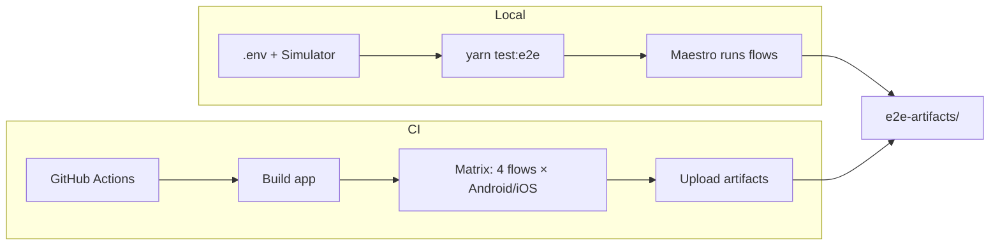

# E2E Testing with Maestro

This directory contains end-to-end (E2E) tests for **freighter-mobile** using
[Maestro](https://maestro.mobile.dev/). E2E tests validate critical user flows
by running the app in a simulator/emulator and simulating real user
interactions.

## Contents

- [Overview](#overview)
- [Documentation Index](#documentation-index)
- [Prerequisites](#prerequisites)
- [Test Structure](#test-structure)
- [Quick Start](#quick-start)
- [Test Flows](#test-flows)
- [Known Limitations](#known-limitations)
- [Troubleshooting](#troubleshooting)
- [Resources](#resources)

---

## Overview



E2E tests run **locally** (with Maestro CLI + simulator/emulator) or in **CI**
(GitHub Actions). Both produce artifacts (logs, recordings, screenshots) under
`e2e-artifacts/` for debugging.

---

## Documentation Index

Detailed guides live in `e2e/docs/`:

| Topic                     | File                                                          | Description                                                                                                    |
| ------------------------- | ------------------------------------------------------------- | -------------------------------------------------------------------------------------------------------------- |
| **CI & Triggers**         | [ci-and-triggers.md](docs/ci-and-triggers.md)                 | When tests run, branch filters, manual runs (workflow_dispatch, `/e2e`), CI matrix parallelism                 |
| **Local Setup & Env**     | [local-setup-and-env.md](docs/local-setup-and-env.md)         | `.env` for E2E, `E2E_TEST_RECOVERY_PHRASE`, `E2E_TEST_FUNDED_RECOVERY_PHRASE`, how secrets/vars are used in CI |
| **Running Tests**         | [running-tests.md](docs/running-tests.md)                     | Run in CI vs locally, single flow by platform + name                                                           |
| **Artifacts & Debugging** | [artifacts-and-debugging.md](docs/artifacts-and-debugging.md) | Artifact layout, logs, recordings, screenshots, how to debug failures                                          |
| **Creating Tests**        | [creating-tests.md](docs/creating-tests.md)                   | Maestro YAML (API), Maestro Studio, recording flows, best practices (e.g. prefer `testID`)                     |

---

## Prerequisites

### 1. Install Maestro

```bash
brew tap mobile-dev-inc/tap
brew install mobile-dev-inc/tap/maestro
maestro --version
```

### 2. Environment

- Set `IS_E2E_TEST=true` in `.env` (enables test-specific app behavior).
- For **Import Wallet** flows: set `E2E_TEST_RECOVERY_PHRASE` in `.env`.
- For **Send/Swap/WalletConnect** flows (use ImportFundedWallet): set
  `E2E_TEST_FUNDED_RECOVERY_PHRASE` in `.env`. See
  [local-setup-and-env.md](docs/local-setup-and-env.md) and `.env.example`.

### 3. iOS Simulator / Android Emulator

- **iOS**: Run `yarn ios` (or `yarn ios-dev`) to boot a simulator and install
  the app
- **Android**: Run `yarn android` (or `yarn android-dev`) to start an emulator
  and install the app

---

## Test Structure

```
e2e/
├── config.yaml           # Maestro config (appId, disableAnimations)
├── README.md             # This file
├── docs/                 # Detailed guides (see Documentation Index)
├── scripts/              # Helper scripts (start/stop mock server)
└── flows/
    ├── debug/            # Debug flows for development
    ├── onboarding/       # Wallet creation and import flows
    │   ├── CreateWallet.yaml
    │   ├── ImportWallet.yaml
    │   └── ImportFundedWallet.yaml
    ├── transactions/     # Transaction flows (send and swap on mainnet)
    │   ├── SendClassicTokenMainnet.yaml      # Send 0.000001 XLM to a different address
    │   └── SwapClassicTokenMainnet.yaml      # Swap 0.000001 XLM → USDC on mainnet
    └── walletconnect/    # WalletConnect integration tests
        ├── SignMessageMockDapp.yaml
        ├── SignMessageRejectionMockDapp.yaml
        ├── SignMessageNetworkMismatchMockDapp.yaml
        ├── SignMessageVariations.yaml
        └── SwitchToTestnet.yaml
```

---

## Quick Start

1. **Configure `.env`** Check `.env.example`, set `IS_E2E_TEST=true` and:

   - `E2E_TEST_RECOVERY_PHRASE` for Import Wallet flows
   - `E2E_TEST_FUNDED_RECOVERY_PHRASE` for Send/Swap/WalletConnect flows

   See [local-setup-and-env.md](docs/local-setup-and-env.md).

2. **Build and run the app** (e.g. iOS):

   ```bash
   yarn ios-dev
   ```

3. **Run an E2E test**:

   ```bash
   yarn test:e2e:ios CreateWallet
   ```

   For Android use `yarn test:e2e:android`. See
   [running-tests.md](docs/running-tests.md) for **all platforms**,
   **single-flow** runs, and **CI** behaviour.

---

## Test Flows

| Flow                                   | File                                                          | Description                                                                                   |
| -------------------------------------- | ------------------------------------------------------------- | --------------------------------------------------------------------------------------------- |
| **Create Wallet**                      | `flows/onboarding/CreateWallet.yaml`                          | "Create a new wallet" → password → recovery phrase → skip validation → skip biometrics → home |
| **Import Wallet**                      | `flows/onboarding/ImportWallet.yaml`                          | "I already have a wallet" → password → recovery phrase → skip biometrics → home               |
| **Import Funded Wallet**               | `flows/onboarding/ImportFundedWallet.yaml`                    | Import wallet with funded account (uses `E2E_TEST_FUNDED_RECOVERY_PHRASE`)                    |
| **Send Classic Token (Mainnet)**       | `flows/transactions/SendClassicTokenMainnet.yaml`             | Imports funded wallet → home → send 0.000001 XLM to recipient → confirm → "Sent"              |
| **Swap Classic Token (Mainnet)**       | `flows/transactions/SwapClassicTokenMainnet.yaml`             | Imports funded wallet → home → swap 0.000001 XLM → USDC → confirm → "Swapped"                 |
| **WC Sign Message (Approval)**         | `flows/walletconnect/SignMessageMockDapp.yaml`                | Connect to dApp → approve signMessage → verify signature returned                             |
| **WC Sign Message (Rejection)**        | `flows/walletconnect/SignMessageRejectionMockDapp.yaml`       | Connect to dApp → reject signMessage → verify session recovery                                |
| **WC Sign Message (Network Mismatch)** | `flows/walletconnect/SignMessageNetworkMismatchMockDapp.yaml` | Connect to dApp → request wrong network → switch network → approve                            |
| **WC Sign Message (Variations)**       | `flows/walletconnect/SignMessageVariations.yaml`              | Full WalletConnect session flow with message variations                                       |

**Test data**: Password `TestPassword123!`;

- Recovery phrase from `E2E_TEST_RECOVERY_PHRASE` for ImportWallet
- Funded recovery phrase from `E2E_TEST_FUNDED_RECOVERY_PHRASE` for
  ImportFundedWallet

See [Test Data](docs/local-setup-and-env.md#test-data) in local-setup-and-env.
**Never** use these in production or commit real secrets.

**WalletConnect tests**: Require mock dApp server running. See
[WalletConnect E2E Testing](docs/walletconnect-e2e-testing.md) for setup and
[Mock dApp README](../mock-dapp/README.md) for server usage.

---

## Known Limitations

- **Recovery phrase validation** (Create Wallet): The flow skips validation
  (taps "Skip") and does not exercise the word-grid confirmation. Adding full
  validation would require test flow changes and UI-specific selectors.
- **Biometrics**: Always skipped in E2E flows for simplification (we tap Skip /
  Don't Allow). Biometric enrollment or verification is not exercised.
- **ImportWallet vs ImportFundedWallet**:
  - `ImportWallet` uses `E2E_TEST_RECOVERY_PHRASE` for basic wallet import flows
  - `ImportFundedWallet` uses `E2E_TEST_FUNDED_RECOVERY_PHRASE` and is required
    for Send/Swap/WalletConnect flows that need funded accounts
  - Ensure both recovery phrases are set in `.env` locally or in CI secrets
- **WalletConnect**: Requires mock dApp server to simulate external requests.
  Server must be running before executing WalletConnect flows. Not all
  production dApps support all WalletConnect methods in testing.

---

## Troubleshooting

| Issue                 | Checklist                                                                                            |
| --------------------- | ---------------------------------------------------------------------------------------------------- |
| **Tests don't start** | App built and running in simulator/emulator; `IS_E2E_TEST=true` in `.env`; `maestro --version` works |
| **Element not found** | Correct screen; `testID`s in components; run `maestro test --debug`                                  |
| **Timeouts**          | Increase timeouts in flows; ensure simulator/emulator has enough resources; check network            |

For **debugging failures** using logs, recordings, and screenshots, see
[artifacts-and-debugging.md](docs/artifacts-and-debugging.md).

---

## Resources

- [Maestro Documentation](https://maestro.mobile.dev/)
- [Maestro GitHub](https://github.com/mobile-dev-inc/maestro)
- [Maestro Best Practices](https://maestro.mobile.dev/best-practices)
