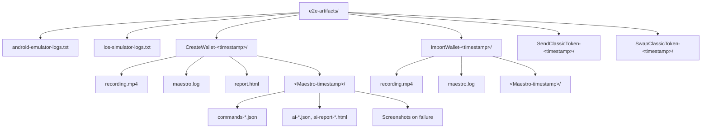

# Artifacts & Debugging

Where E2E artifacts live and how to use them to debug failures.

## Artifact layout

### Root-level logs (CI)

| File                        | Platform | Description                                                                 |
| --------------------------- | -------- | --------------------------------------------------------------------------- |
| `android-emulator-logs.txt` | Android  | Logcat capture (React Native, app package, "freighter") during the test run |
| `ios-simulator-logs.txt`    | iOS      | `log stream` for the app process during the test run                        |

### Per-flow directories

Each flow produces `e2e-artifacts/<FlowName>-<timestamp>/`:

**Directly in flow folder:** | Content | Source | Description |
|---------|--------|-------------| | `recording.mp4` | `run-e2e-tests.sh` |
Screen recording for that flow (simctl/adb) | | `maestro.log` | Maestro (moved
by script) | Maestro logs for the run (moved from nested `.maestro/tests/`
folder) | | `report.html` | Maestro | HTML test report with execution summary
(pass/fail), per-flow status, and failure error messages. Workaround for
[Maestro issue #2098](https://github.com/mobile-dev-inc/maestro/issues/2098). |

**In Maestro's timestamped subfolder**
(`<FlowName>-<timestamp>/<Maestro-timestamp>/`): | Content | Source |
Description | |---------|--------|-------------| | `commands-*.json` | Maestro |
Command metadata | | `ai-*.json`, `ai-report-*.html` | Maestro | AI analysis
files (currently not useful - only show "0 possible defects found" without
execution details; see
[Maestro issue #2098](https://github.com/mobile-dev-inc/maestro/issues/2098)) |
| Screenshots | Maestro | On failure; stored in the timestamped subfolder |

## CI uploads

Artifacts are uploaded per **matrix job**:

- **Android**: `android-e2e-results-<run_id>-<flow-name>`
- **iOS**: `ios-e2e-results-<run_id>-<flow-name>`

Each artifact is the **entire** `e2e-artifacts/` directory for that job (so one
flow per job). Retention: **7 days**.  
Download from the **Actions** run → **Summary** → **Artifacts**.

## Debugging a failed test

1. **Download** the artifact for the failed flow (e.g.
   `android-e2e-results-123-SendClassicToken`).
2. **Device Logs**:
   - Android: `e2e-artifacts/android-emulator-logs.txt`
   - iOS: `e2e-artifacts/ios-simulator-logs.txt`  
     Check for crashes, JS errors, and app-specific logs.
3. **Recording**: Play `e2e-artifacts/<FlowName>-<ts>/recording.mp4` to see what
   the app did during the run.
4. **HTML Report**: Open `e2e-artifacts/<FlowName>-<ts>/report.html` in a
   browser for a visual execution summary (pass/fail, duration, per-flow status,
   and failure error messages). For step-level details and screenshots, use
   `maestro.log`, `commands-*.json`, and the screenshots in the timestamped
   subfolder.
5. **Maestro Logs**:
   - Open `e2e-artifacts/<FlowName>-<ts>/maestro.log` to see which step failed
     and why.
   - Open `e2e-artifacts/<FlowName>-<ts>/<Maestro-timestamp>/commands-*.json` to
     see which step failed and why.
6. **Screenshots**: If Maestro captured screenshots on failure, find them in
   `e2e-artifacts/<FlowName>-<ts>/<Maestro-timestamp>/` to see the UI at the
   point of failure.
7. **GitHub Actions UI workflow logs**: You can also check the workflow run logs
   directly in the GitHub Actions UI. Maestro output is available in:
   - **Android**: "Boot Android Emulator and Run E2E Tests" step
   - **iOS**: "Run E2E tests" step This is useful for quick inspection without
     downloading artifacts.

Combine logs + recording + Maestro output to narrow down flakiness, missing
`testID`s, or timing issues.
