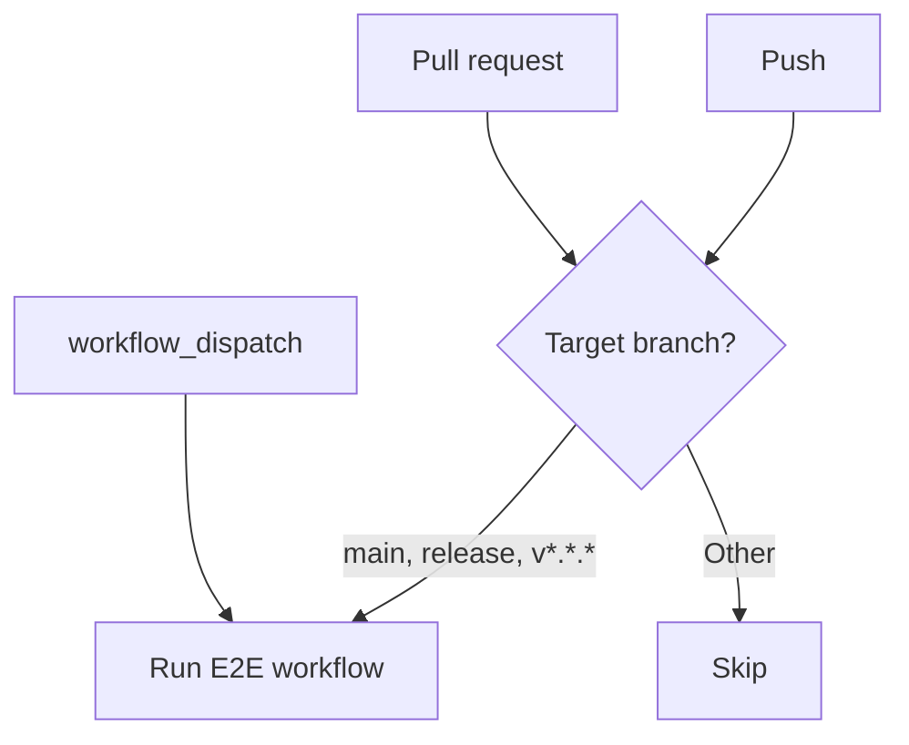
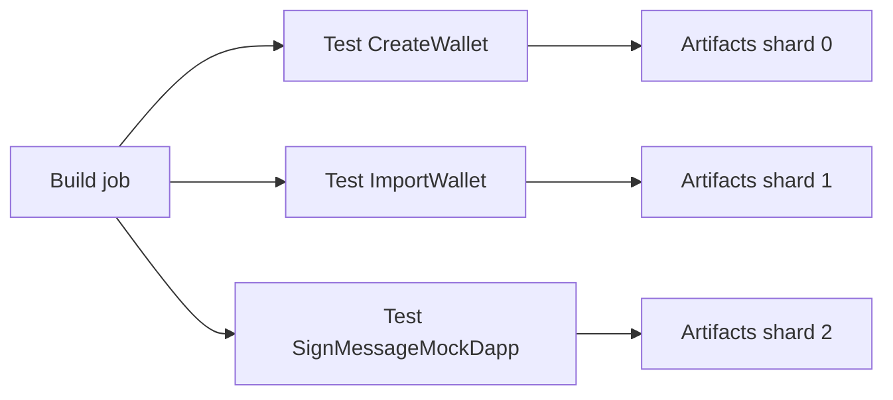

# CI & Triggers

E2E tests run in GitHub Actions via **Android** and **iOS** workflows. This page
covers when they run, how to trigger them manually, and how the CI matrix works.

## When do E2E tests run?

| Trigger               | Condition                                                                                          |
| --------------------- | -------------------------------------------------------------------------------------------------- |
| **Pull request**      | `opened`, `synchronize`, `reopened`, `ready_for_review` on `main`, `release`, or `v*.*.*` branches |
| **Push**              | Same branches as above                                                                             |
| **workflow_dispatch** | Manual run from **Actions** tab                                                                    |

**Branch patterns**: `v*.*.*` matches semantic versions (e.g. `v1.2.3`), not
arbitrary names like `vrandombranch`.

## Manual runs

Use **workflow_dispatch** to run E2E tests on demand:

1. Open **Actions** → **Android E2E Tests** or **iOS E2E Tests**.
2. Click **Run workflow**.
3. Optionally set **ref** (commit hash) or leave empty for default branch.
4. Run.

## CI matrix & parallelism

- **One build job** per workflow (Android or iOS). Output: `app.apk` /
  `app.tar.gz`.
- **Test job** uses a **matrix**: 3 shards, each running a **single flow**.
  - Shard 0 → `CreateWallet` - Basic wallet creation
  - Shard 1 → `ImportWallet` - Wallet import with recovery phrase
  - Shard 2 → `SignMessageMockDapp` - WalletConnect sign message flow

**Note:** `SendClassicTokenMainnet` and `SwapClassicTokenMainnet` test mainnet
transactions with small amounts (0.000001 XLM) and are available locally but
excluded from CI to keep the matrix lean and avoid transient mainnet API
failures. Run them locally with `yarn test:e2e:ios SendClassicTokenMainnet`.

Matrix is **fail-fast: false**, so one failing flow does not cancel the others.
Each matrix job uploads its own artifacts (see
[Artifacts & Debugging](artifacts-and-debugging.md)).

## Workflow files

| Platform | Workflow file                       |
| -------- | ----------------------------------- |
| Android  | `.github/workflows/android-e2e.yml` |
| iOS      | `.github/workflows/ios-e2e.yml`     |
