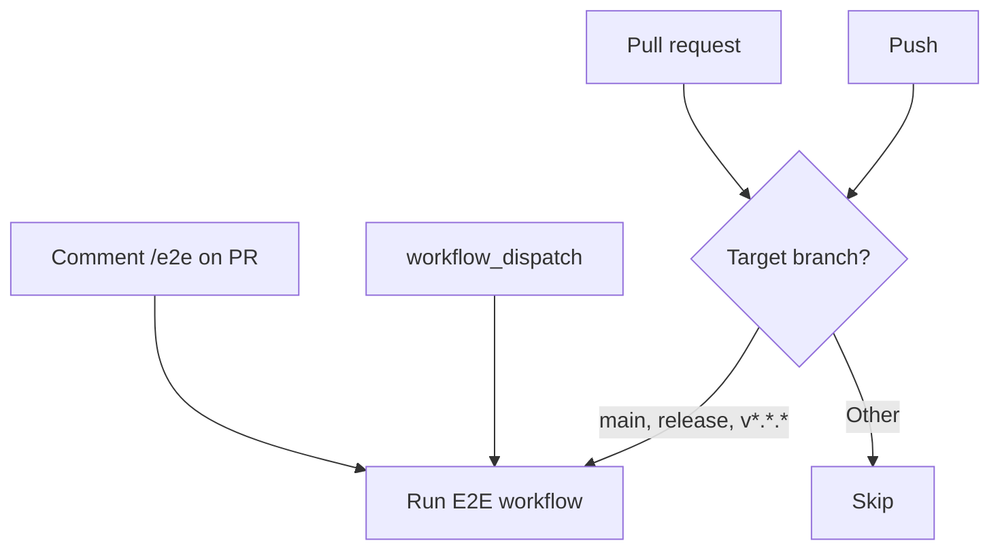
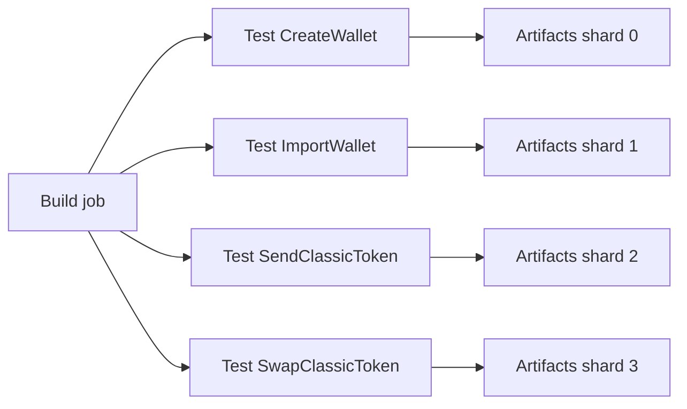

# CI & Triggers

E2E tests run in GitHub Actions via **Android** and **iOS** workflows. This page
covers when they run, how to trigger them manually, and how the CI matrix works.

## When do E2E tests run?

| Trigger               | Condition                                                                                 |
| --------------------- | ----------------------------------------------------------------------------------------- |
| **Pull request**      | `opened`, `synchronize`, `reopened`, `ready_for_review` on `main`, `release`, or `v*.*.*` |
| **Push**              | Same branches                                                                             |
| **Issue comment**     | Comment **exactly** `/e2e` on a PR (runs on that PR's head)                               |
| **workflow_dispatch** | Manual run from **Actions** tab                                                           |

**Branch patterns**: `v*.*.*` matches semantic versions (e.g. `v1.2.3`), not
arbitrary names like `vrandombranch`.

## Manual runs

### 1. workflow_dispatch

1. Open **Actions** → **Android E2E Tests** or **iOS E2E Tests**.
2. Click **Run workflow**.
3. Optionally set **ref** (commit hash) or leave empty for default branch.
4. Run.

### 2. Comment `/e2e` on a PR

Comment **exactly** `/e2e` on a pull request. The workflow runs for that PR's
head. Build and test jobs use the same ref.

## CI matrix & parallelism

- **One build job** per workflow (Android or iOS). Output: `app.apk` /
  `app.tar.gz`.
- **Test job** uses a **matrix**: 4 shards, each running a **single flow**.
  - Shard 0 → `CreateWallet`
  - Shard 1 → `ImportWallet`
  - Shard 2 → `SendClassicToken`
  - Shard 3 → `SwapClassicToken`

Matrix is **fail-fast: false**, so one failing flow does not cancel the others.
Each matrix job uploads its own artifacts (see
[Artifacts & Debugging](artifacts-and-debugging.md)).

## Workflow files

| Platform | Workflow file                       |
| -------- | ----------------------------------- |
| Android  | `.github/workflows/android-e2e.yml` |
| iOS      | `.github/workflows/ios-e2e.yml`     |
