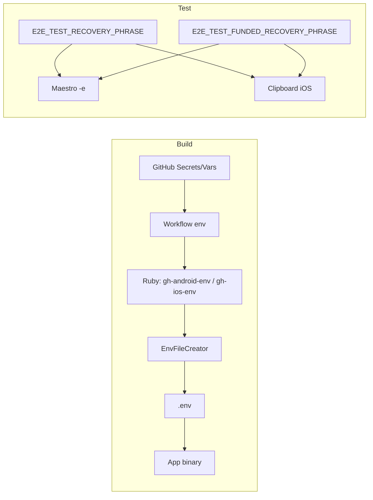

# Local Setup & Environment

How to configure your environment for E2E tests locally and how
secrets/variables are used in CI.

## .env for local E2E

Create a `.env` from `.env.example` and set at least:

| Variable                          | Required                    | Description                                                                               |
| --------------------------------- | --------------------------- | ----------------------------------------------------------------------------------------- |
| `IS_E2E_TEST`                     | Yes                         | Set to `true` for E2E. Enables test-specific behavior in the app.                         |
| `E2E_TEST_RECOVERY_PHRASE`        | For Import/Send/Swap        | Recovery phrase used by Import Wallet and flows that `runFlow` it.                        |
| `E2E_TEST_FUNDED_RECOVERY_PHRASE` | For Send/Swap/WalletConnect | Recovery phrase for funded wallet used by ImportFundedWallet and flows that `runFlow` it. |
| `E2E_TEST_RECIPIENT_ADDRESS`      | For Send                    | Recipient address used by SendClassicTokenMainnet flow (must not be the active account).  |

Example:

```bash
IS_E2E_TEST=true
# DO NOT add quotes around the recovery phrase as it will break the ImportWallet flow
E2E_TEST_RECOVERY_PHRASE=word1 word2 ... word12
E2E_TEST_FUNDED_RECOVERY_PHRASE=word1 word2 ... word12
E2E_TEST_RECIPIENT_ADDRESS=G...TESTNET_RECIPIENT
```

`run-e2e-tests.sh` loads `E2E_TEST_RECOVERY_PHRASE` and
`E2E_TEST_FUNDED_RECOVERY_PHRASE` from `.env` when they're not already set. **Do
not commit `.env`** or use a phrase that holds real funds.

## Test data

- **Password**: `TestPassword123!` (hardcoded in flows).
- **Recovery phrase**: From `E2E_TEST_RECOVERY_PHRASE` (`.env` locally,
  `secrets.E2E_TEST_RECOVERY_PHRASE` in CI).
- **Funded recovery phrase**: From `E2E_TEST_FUNDED_RECOVERY_PHRASE` (`.env`
  locally, `secrets.E2E_TEST_FUNDED_RECOVERY_PHRASE` in CI).
- **Recipient address**: From `E2E_TEST_RECIPIENT_ADDRESS` for
  SendClassicTokenMainnet.

## Secrets and variables in CI



- **Build**: Workflows set env from **secrets** and **vars**. Scripts
  `gh-android-env` / `gh-ios-env` call `EnvFileCreator`
  (`lib/env_file_creator.rb`), which writes `.env` from `.env.example` keys.
  Required vars must be non-empty; optional `E2E_TEST_*` are only added when
  defined.
- **E2E**: `E2E_TEST_RECOVERY_PHRASE` and `E2E_TEST_FUNDED_RECOVERY_PHRASE` come
  from **secrets**. They're passed to Maestro via `-e` and (on iOS) into the
  simulator clipboard for Import Wallet flows.
- **Masking**: GitHub Actions masks secret values in logs. Avoid printing
  secrets explicitly in scripts.

See `.github/workflows/android-e2e.yml` and `ios-e2e.yml` for the full `env`
blocks.
